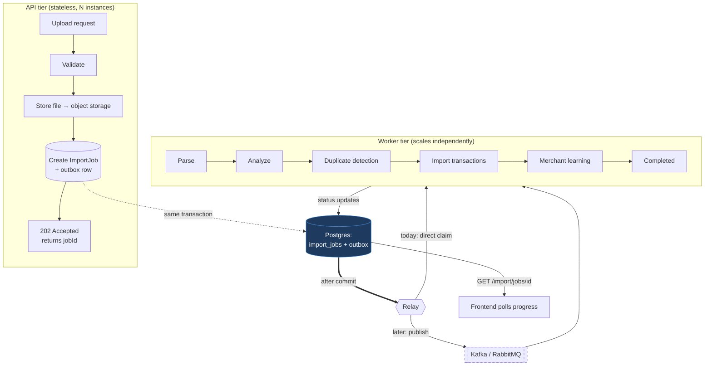

# Import Pipeline — Scaling & Broker-Compatibility Design

**Date:** 2026-08-07 · **Status:** proposal, nothing implemented · **Companion to:**
`IMPORT_ARCHITECTURE_REVIEW.md`

---

## 0. The finding that shapes everything below

Before comparing brokers, one property of the existing code has to be stated, because it constrains
every option.

`MerchantLearningEventPublisher.enqueue()` **writes the queue row inside the caller's transaction,
deliberately.** From its own javadoc:

> The row is written in the CALLER's transaction. If the import rolls back, the queued learning must
> roll back with it — otherwise a worker later applies a confirmation for transactions that do not
> exist.

**No external message broker can provide this.** Kafka and RabbitMQ cannot enlist in a Postgres
transaction. The moment `enqueue()` publishes to a broker instead of inserting a row, you get one of
two failure modes:

- publish **before** commit → the import rolls back, but the event is already in the broker; a
  worker applies learning for transactions that do not exist (the exact bug this class prevents);
- publish **after** commit → the process dies between commit and publish; the event is lost with no
  record it ever existed.

The industry answer is the **transactional outbox**: keep writing the row to Postgres in the
caller's transaction, and have a separate relay publish committed rows to the broker.

**Which means the Postgres queue is not something we migrate away from. It is the foundation any
broker would be built on top of.** A broker changes how work is *distributed*, never how it is
*durably recorded*. This is the single most important input to the roadmap in §9, and it makes the
migration substantially cheaper and lower-risk than "replace the queue" implies.

---

## 1. High-level architecture

Target end state. Everything left of the dashed line is transactional and stays in Postgres
regardless of broker choice.



The dashed broker is deliberate: **the design is identical with or without it.** Adding a broker
inserts a transport between the relay and the workers; it does not change the domain logic, the
durability story, or the job lifecycle.

---

## 2. Queue abstraction design

### 2.1 The trap to avoid

The obvious abstraction is to wrap what the code does today:

```java
// DON'T
interface MessageQueue {
    List<Event> claimBatch(int size);   // SKIP LOCKED — Postgres-specific
    void markCompleted(UUID id);        // update-in-place — Kafka cannot do this
    void markFailed(UUID id, String e); // update-in-place — Kafka cannot do this
}
```

Every method here leaks a Postgres capability. Kafka has no update-in-place (offsets commit
forward; you cannot mark record 5 failed and record 6 done); RabbitMQ has no `SKIP LOCKED` (it
pushes to consumers rather than letting them claim). An interface shaped like this would need
rewriting on contact with the first real broker — which is the standard way premature abstractions
fail.

### 2.2 The seam that actually holds

Split **recording** (transactional, always Postgres) from **dispatch** (swappable transport).

```java
/** Durable, transactional record of work to do. Always Postgres. Not abstracted —
 *  abstracting it is what breaks, and there is no second implementation. */
interface JobStore {
    ImportJob enqueue(ImportJobRequest request);   // joins caller's transaction
    Optional<ImportJob> claim(WorkerId worker);
    void recordProgress(UUID jobId, Stage stage);
    void recordOutcome(UUID jobId, Outcome outcome);
}

/** How a committed job reaches a worker. THIS is the swappable part. */
interface JobDispatcher {
    void dispatch(UUID jobId, Stage nextStage);   // called only after commit
}
```

Two implementations of `JobDispatcher`:

| Implementation | Behaviour |
|---|---|
| `InProcessDispatcher` (today) | `afterCommit` nudge to the local worker, exactly as `MerchantLearningEventPublisher` does now; the `@Scheduled` poller remains the backstop |
| `BrokerDispatcher` (later) | `afterCommit` publish of the job id to Kafka/RabbitMQ; the poller remains the backstop for unpublished rows |

**Business services depend on `JobStore` and `JobDispatcher`, never on Postgres or a broker.**

Three properties worth calling out:

1. **The message is a job id, not a payload.** Workers re-read state from Postgres. This sidesteps
   message-size limits, schema-evolution pain, and stale-payload bugs, and makes the broker
   genuinely swappable because nothing about the payload is broker-shaped.
2. **The poller never goes away.** It is what makes a lost dispatch a delay rather than a loss —
   true for the in-process nudge today and for a broker later. It is the reason the outbox pattern
   is safe.
3. **The dispatcher is an optimisation, never a guarantee** — the property
   `MerchantLearningEventPublisher` already relies on, preserved verbatim.

### 2.3 Honest caveat on abstracting now

An interface with one implementation and no second consumer is usually premature. Two things make
this case defensible, and they should be held to:

- The seam is derived from the **broker's** constraints (§2.1), not invented from the current
  implementation's shape. That is what makes it likely to survive contact with a real broker.
- It is small — two interfaces, one implementation each. If we never adopt a broker, the cost is a
  couple of interfaces, not a framework.

If the team would rather wait, **the no-regret subset is §9 Phase 1** (the job store and lifecycle),
which is required for asynchronous imports regardless of whether a broker is ever adopted.

---

## 3. Kafka vs RabbitMQ vs Postgres `SKIP LOCKED`

| Criterion | Postgres `SKIP LOCKED` | RabbitMQ | Kafka |
|---|---|---|---|
| **Throughput** | ~1–5k msg/s (bounded by our 10-connection pool) | ~20–50k msg/s | ~1M+ msg/s |
| **Reliability** | Same durability as business data — one WAL, one backup | Durable queues + publisher confirms | Replicated log, configurable acks |
| **Delivery semantics** | At-least-once; effectively-once via transactional enqueue | At-least-once | At-least-once; exactly-once within Kafka only |
| **Retry** | Already built (`attemptCount`, `nextAttemptAt`) | Needs delayed-exchange plugin or TTL+DLX | Manual (retry topics) |
| **Dead-letter** | Already built (terminal `FAILED` + admin queue) | First-class DLX | Manual (DLQ topic) |
| **Ordering** | Per-row; whatever the claim query orders by | Per-queue, lost with concurrent consumers | Strong per-partition |
| **Horizontal scale** | Bounded by one Postgres | Clustered, queue-level | Excellent, partition-level |
| **Ops complexity** | **Zero new infrastructure** | Moderate (cluster, plugins, upgrades) | High (brokers, ZK/KRaft, partitions, consumer groups) |
| **Cost on Railway** | £0 | ~$20–50/mo | ~$100–300/mo, or managed Confluent |
| **Monitoring** | SQL — already have admin queue UI | Management UI + Prometheus | JMX + Prometheus; needs lag monitoring |
| **Disaster recovery** | Covered by existing DB backups | Separate backup story | Separate backup story |
| **Transactional enqueue** | ✅ **Native** | ❌ Needs outbox | ❌ Needs outbox |

### 3.1 The throughput column is a distraction

Kafka's throughput advantage is ~200× Postgres's. It is also **irrelevant to our bottleneck.**

From the measured E2E data: import costs **~16ms per transaction row**. For 50,000 users × 5,000
rows, the work is ~46 CPU-days regardless of transport. Queue operations are a rounding error
against that — we need on the order of *tens of thousands of messages total*, not per second.

**Choosing Kafka to fix our scaling problem would be solving the one part that isn't broken.** The
throughput ceiling that matters is CPU in the parse path, and no broker moves it.

### 3.2 Fit for Finora

- **Postgres `SKIP LOCKED`** — correct choice today, by a wide margin. Already implemented, already
  operated, already backed up, and the only option with native transactional enqueue. Its real
  ceiling is a single Postgres instance's write throughput, which we are nowhere near.
- **RabbitMQ** — the natural first broker *if* one is ever needed. Per-message retry/DLX map closely
  onto the semantics we already have, and the operational step up is moderate. Best fit for
  work-queue distribution.
- **Kafka** — the wrong shape for this problem. Its strengths (partitioned ordered log, replay,
  stream processing, extreme throughput) address needs we do not have; its costs (partition
  planning, consumer-group rebalancing, no update-in-place for per-message state) are real. It would
  become interesting for a genuine event-streaming use case — analytics pipelines, event sourcing,
  multi-consumer fan-out — not for "run this import job."

---

## 4. Recommended migration strategy

**Do not migrate. Build the seam, stay on Postgres, and let evidence decide.**

1. **Now** — implement `JobStore` + `JobDispatcher` with `InProcessDispatcher`. Business logic
   depends only on the interfaces.
2. **Instrument** — queue depth, claim latency, jobs/sec, worker utilisation, p95 job duration.
   These are needed to operate the system anyway, and they are the evidence for step 3.
3. **Trigger** — adopt a broker only when a stated threshold is actually crossed (§8).
4. **If triggered** — add `BrokerDispatcher` alongside, run both behind a flag, migrate one stage,
   verify, then proceed. The outbox stays; only the transport changes.

Because messages carry only a job id and Postgres remains the source of truth, this migration
touches the dispatcher and the worker's entry point — **not the domain logic**.

---

## 5. Deployment topology

**Today (single Railway service):** API and workers in one process; `@Scheduled` pollers run
in-process; `ImportConcurrencyLimiter` bounds concurrency per JVM.

**Phase 4 target (no broker):**

```
Cloudflare Pages ×2  ──►  Railway: finora-api (N replicas, web)
                                      │
                                      ▼
                          Railway: Postgres  ◄──  Railway: finora-worker (M replicas)
                                      ▲                         │
                                      └─────────────────────────┘
                                   Cloudflare R2 (statement files)
```

A `worker` Spring profile runs the schedulers with the web layer disabled. API and workers scale
independently; `SKIP LOCKED` already makes multi-worker claims safe — **this is the key point: no
broker is required to scale workers horizontally.**

Two changes are prerequisites:

- **Object storage must be on** (`app.statement-storage.provider=r2`). A worker in another process
  cannot read a `MultipartFile` from the API's heap. R2 is already implemented.
- **Connection pool budgeting.** `DB_POOL_MAX_SIZE:10` is per instance. 10 API + 20 workers × 10 =
  300 connections against a Postgres that will not allow that. Pool sizes must be set from a total
  budget, not per-service defaults. **This is the most likely first thing to break when scaling
  out**, and it has nothing to do with queues.

---

## 6. Scalability estimates

Assuming the per-row cost is unchanged (~16ms) and a worker handles 6 concurrent imports:

| Workers | Statements/hour (5,000 rows each) | Time for 50,000 |
|---:|---:|---:|
| 1 | ~273 | ~7.6 days |
| 10 | ~2,730 | ~18 hours |
| 50 | ~13,600 | ~3.7 hours |
| 100 | ~27,300 | ~1.8 hours |

With the per-row cost reduced 10× (a realistic target if per-row merchant resolution is batched —
**unprofiled, see §8**):

| Workers | Time for 50,000 |
|---:|---:|
| 10 | ~1.8 hours |
| 50 | ~22 minutes |
| 100 | ~11 minutes |

**Read this table as the core argument of the document.** Every row is achievable on the Postgres
queue. Nothing here is blocked by lacking a broker; everything is gated on worker count and per-row
cost. Long before 100 workers, Postgres connection limits (§5) bind before queue throughput does.

---

## 7. Operational considerations

Required regardless of broker choice:

- **Queue metrics** — depth by status, oldest pending age, claim rate, p50/p95/p99 duration, retry
  and DLQ counts.
- **Worker health** — liveness, last successful claim, in-flight count. A worker that dies mid-job
  is already handled by the stuck-in-`PROCESSING` recovery; it should also be *visible*.
- **Back-pressure** — a queue-depth threshold that returns `503` at upload rather than accepting
  unbounded work. `ImportConcurrencyLimiter` does this in-process today; it needs a queue-aware
  equivalent.
- **Alerting** — DLQ growth, oldest-pending exceeding SLO, worker count zero.
- **Idempotency** — at-least-once delivery means a job may be processed twice. The learning worker
  handles this via its unique constraint; the import path needs an equivalent guard before workers
  scale out.

---

## 8. Risks and trade-offs

| Risk | Severity | Mitigation |
|---|---|---|
| **Abstraction built for a broker never adopted** | Medium | Keep it to two small interfaces; the `JobStore` half is needed for async imports regardless |
| **Per-row cost assumed fixable but unprofiled** | **High** | §6's second table assumes a 10× win with no profiling behind it. A previous optimisation here was measured and correctly reverted. Profile before promising this |
| Connection-pool exhaustion when scaling workers | High | Budget pools globally (§5); likely the first real ceiling |
| Duplicate processing under at-least-once | Medium | Idempotency guard on the import path before scaling out |
| Outbox relay becomes a bottleneck | Low | Only relevant post-broker; relay is I/O-bound and trivially parallel |
| Losing transactional enqueue in a naive broker migration | **High** | The outbox pattern is non-negotiable — §0 |
| Operational burden of a broker nobody needed | Medium | Evidence-gated adoption (below) |

### Adoption triggers — the evidence that would justify a broker

Adopt one only when a measured threshold is crossed:

- Sustained queue depth > 10,000 jobs during normal operation, **or**
- Postgres claim contention measurably limiting throughput (claim latency rising with worker count),
  **or**
- Worker count needed exceeds what Postgres connection limits allow even after pool budgeting, **or**
- A genuine second consumer appears for the same events (analytics, fan-out) — the case where
  Kafka's model actually earns its cost.

Until one of these is observed, **the Postgres queue is the right answer and adopting a broker would
be adding operational surface to solve a problem we do not have.**

---

## 9. Phased roadmap

| Phase | Work | Depends on | Effort |
|---|---|---|---|
| **1** | `ImportJob` + lifecycle + `JobStore`; `ImportJobWorker` cloned from `MerchantLearningEventWorker`; `202 Accepted` + status endpoint | — | M |
| **2** | Frontend progress UI | 1 | M |
| **3** | Object storage on by default (R2) | — | S |
| **4** | `worker` profile; separate Railway service; **global connection-pool budgeting** | 1, 3 | M |
| **5** | Queue metrics, worker health, queue-aware back-pressure, alerting | 1 | S |
| **6** | **Profile** the parse path; batch merchant resolution if profiling supports it | 1 | M |
| **7** | Extract `JobDispatcher`; `InProcessDispatcher` as the only implementation | 1 | S |
| **8** | `BrokerDispatcher` — **only if an §8 trigger fires** | 7 + evidence | L |

Phases 1–6 deliver every objective in the brief — 50,000+ uploads, horizontal scaling, independent
worker scaling, fault tolerance, back-pressure, monitoring — **with no broker at all.** Phase 7 is
the cheap insurance that keeps Phase 8 from being a rewrite. Phase 8 is deliberately gated on
evidence rather than scheduled.

---

## 10. Summary

- **Transactional enqueue is the binding constraint.** No broker offers it; the outbox pattern means
  Postgres stays as the durable record whatever we adopt. The Postgres queue is the foundation, not
  the thing being replaced.
- **Abstract dispatch, not storage.** An interface shaped like `claimBatch`/`markCompleted` leaks
  Postgres semantics and would not survive contact with Kafka.
- **The broker decision is not on the critical path for the stated goal.** 50,000 concurrent uploads
  are reachable on Postgres with more workers and a cheaper per-row cost. Both bottlenecks are
  CPU and connection limits, not message transport.
- **If a broker is ever warranted, RabbitMQ fits better than Kafka** — but the honest position is
  that neither is warranted on current evidence, and the triggers in §8 should decide it.
- **The highest-value next step is Phase 1**, which is required for asynchronous imports whether or
  not a broker is ever adopted.

Nothing in this document has been implemented.
