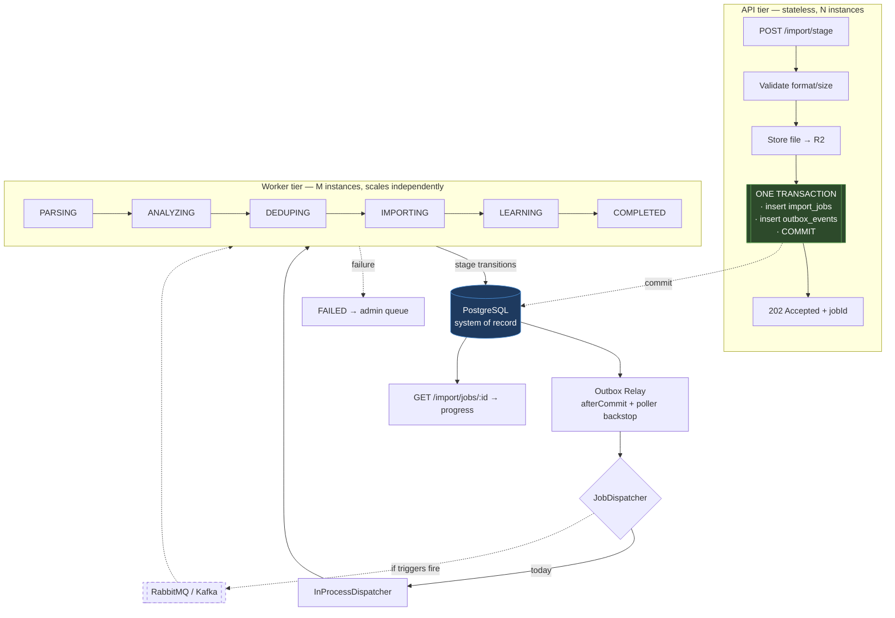

# Enterprise-Scale Import Milestone — Design Package

**Date:** 2026-08-07 · **Status:** design only, nothing implemented
**Governing decision:** [ADR-003](../architecture/adr-003-transactional-outbox-and-messaging.md)

---

## Deliverables index

Several deliverables were produced during the review that led to this milestone. They are not
restated here; this document fills the gaps and ties the set together.

| # | Deliverable | Where |
|---|---|---|
| 1 | Architecture diagrams | §2 here, plus `import-pipeline-scaling-design.md` §1 |
| 2 | Detailed implementation plan | **§10 here** |
| 3 | Queue abstraction design | `import-pipeline-scaling-design.md` §2; refined in **§3 here** |
| 4 | Transactional outbox design | **§3 here** |
| 5 | Import pipeline redesign | **§4 here** |
| 6 | Worker architecture | **§5 here** |
| 7 | Scalability model | `import-pipeline-scaling-design.md` §6 |
| 8 | Capacity planning | **§6 here** |
| 9 | Database optimization strategy | **§7 here** (evidence: `performance/import-pipeline-profile-2026-08-07.md`) |
| 10 | Broker comparison | `import-pipeline-scaling-design.md` §3 |
| 11 | Deployment architecture | **§6 here**, extending `import-pipeline-scaling-design.md` §5 |
| 12 | Failure and recovery strategy | **§8 here** |
| 13 | Monitoring strategy | **§9 here** |
| 14 | Testing strategy | **§11 here** |
| 15 | Migration roadmap | **§10 here** |

---

## 1. One recommendation before the plan

**Priority 1 (category-rule caching) should not wait for this package to be approved.**

The directive says "evidence before implementation" and "performance before additional
infrastructure". For that one change the evidence already exists and is unambiguous: 2 queries per
row, 800 for a 400-row import, collapsing to 1. It is a per-import cache of data that cannot change
during an import, it touches no architecture, and it is independently testable and revertible.

Holding it behind a fifteen-deliverable design package inverts the principle it was meant to serve.
Recommend shipping it as its own measured change — before/after SQL counts, timings, correctness
tests — while the rest of this milestone is reviewed.

Priorities 2 and 3 are correctly gated: duplicate detection is a semantics change (what counts as a
duplicate), and merchant resolution already has one reverted attempt behind it.

---

## 2. Target architecture



The green box is the correctness boundary from ADR-003: domain data and the event commit together
or not at all. The dashed broker is optional and additive.

---

## 3. Transactional outbox design

### 3.1 Schema

```sql
CREATE TABLE outbox_events (
    id              UUID PRIMARY KEY,
    aggregate_type  VARCHAR(64)  NOT NULL,   -- 'ImportJob'
    aggregate_id    UUID         NOT NULL,   -- the job id
    event_type      VARCHAR(64)  NOT NULL,   -- 'ImportJobQueued', 'StageCompleted'
    payload         JSONB        NOT NULL,   -- {stage, correlationId} — NOT business data
    correlation_id  UUID         NOT NULL,
    created_at      TIMESTAMPTZ  NOT NULL DEFAULT now(),
    published_at    TIMESTAMPTZ,             -- NULL = not yet dispatched
    attempt_count   INT          NOT NULL DEFAULT 0,
    next_attempt_at TIMESTAMPTZ  NOT NULL DEFAULT now(),
    last_error      TEXT
);

-- Partial index: the relay only ever scans unpublished rows, and this keeps that scan
-- proportional to the backlog rather than to table size.
CREATE INDEX idx_outbox_unpublished
    ON outbox_events (next_attempt_at)
    WHERE published_at IS NULL;
```

**`payload` carries a job id and a stage, never business data.** Workers re-read state from
PostgreSQL. This is what keeps the transport swappable, avoids message-size limits and schema
evolution, and makes a stale message harmless.

### 3.2 Write path

```java
@Transactional
public ImportJob acceptUpload(UUID userId, StoredStatement stored) {
    ImportJob job = jobStore.enqueue(ImportJobRequest.of(userId, stored.address()));
    outbox.record(new ImportJobQueued(job.getId(), correlationId));   // same transaction
    return job;                                                       // caller commits
}
```

`outbox.record` **must not** open its own transaction — the same rule
`MerchantLearningEventPublisher.enqueue` already follows, and for the same reason. An
architecture test should enforce it (§11).

### 3.3 Relay

Two triggers, exactly mirroring the proven learning-queue design:

1. **`afterCommit` nudge** — dispatches immediately in the common case.
2. **`@Scheduled` poller** — claims unpublished rows with `FOR UPDATE SKIP LOCKED`, retries with
   exponential backoff.

**The poller is not a fallback, it is the correctness mechanism.** If the process dies between
commit and nudge, the row is still unpublished and the poller collects it. This is what makes
at-least-once delivery true rather than aspirational.

Backoff: `min(2^attempt seconds, 5 minutes)`, terminal after 10 attempts → alert. Rows are marked
`published_at` only after the dispatcher confirms hand-off.

### 3.4 Interfaces

Per ADR-003 — abstract dispatch, not storage:

```java
interface JobStore {          // always PostgreSQL, deliberately not abstracted
    ImportJob enqueue(ImportJobRequest r);        // joins caller's transaction
    Optional<ImportJob> claim(WorkerId w, Stage s);
    void recordStage(UUID jobId, Stage s);
    void recordOutcome(UUID jobId, Outcome o);
}

interface JobDispatcher {     // the swappable half
    void dispatch(UUID jobId, Stage next);        // called only after commit
}
```

---

## 4. Import pipeline redesign

### 4.1 Job lifecycle

```
UPLOADED → QUEUED → PARSING → ANALYZING → DEDUPING → IMPORTING → LEARNING → COMPLETED
                        ↓         ↓          ↓           ↓           ↓
                     FAILED (terminal, after max attempts → admin queue)
                        ↓
                    CANCELLED (user-initiated, only before IMPORTING)
```

`IMPORTING` is the point of no return for user-visible data. Before it, a failure discards staged
work and is safe to retry wholesale. After it, retry must be idempotent (§8.3).

### 4.2 Upload endpoint

```
POST /api/v1/import/csv/stage
  → validate format, size, row-count ceiling      (cheap, synchronous)
  → store file to R2                              (I/O, synchronous, bounded)
  → BEGIN: insert import_jobs + outbox_events; COMMIT
  → 202 Accepted {jobId, statusUrl}
```

Response target: **under 500ms**, dominated by the R2 upload.

### 4.3 Progress endpoint

```
GET /api/v1/import/jobs/{jobId}
  → {jobId, status, stage, rowsTotal, rowsProcessed, startedAt, error?, correlationId}
```

Polling at 1–2s is sufficient and avoids introducing WebSockets/SSE for a flow measured in seconds.
Revisit only if imports routinely run long enough that polling cost matters.

### 4.4 Row-count ceiling

The current `UPLOAD_MAX_FILE_SIZE: 10MB` permits files that cannot complete
(`E2E_TEST_REPORT.md` Issue 02). Validation must reject on **row count**, not just bytes, with a
clear error naming the limit. The limit should be derived from measured throughput after §7 lands,
not guessed now.

---

## 5. Worker architecture

### 5.1 Shape

Each stage is a claim-process-transition step, structurally identical to
`MerchantLearningEventWorker`, which already solves the hard parts:

- **Claim** — `FOR UPDATE SKIP LOCKED`, flip to the in-progress status, commit. Safe across
  instances.
- **Process** — one transaction per job. A poisoned transaction costs one job.
- **Record outcome** — a *fresh* transaction, entered after the process transaction has rolled
  back, so the failure actually persists.

**That three-boundary structure is not optional and not a stylistic choice.** It exists because a
constraint violation marks a transaction rollback-only, so a failure recorded inside it would be
rolled back too, returning the job to the queue with no evidence of what went wrong — forever. Any
new worker that collapses these boundaries reintroduces that bug.

### 5.2 Stage granularity

**Recommendation: one worker, stages as internal steps within a single claim — not a queue per
stage.**

Rationale: per-stage queues buy independent scaling of each stage, at the cost of a hand-off and a
durability decision between every stage. The stages here are sequential on one job with no fan-out,
and total pipeline time is seconds. Per-stage queues would be five times the moving parts for
throughput we can get more cheaply by adding whole workers.

Stage is still recorded per transition (progress, diagnosis, resumability). If a stage later proves
to need genuinely independent scaling, the outbox already supports splitting it out — the design
does not foreclose it.

### 5.3 Deployment

A `worker` Spring profile: schedulers on, web layer off. Deployed as a separate Railway service
scaled independently of the API. Prerequisite: object storage on (§6).

---

## 6. Capacity planning and deployment

### 6.1 The real ceiling

Current values: `DB_POOL_MAX_SIZE:10` per instance, `IMPORT_MAX_CONCURRENT:6`.

Pool size is **per instance**, so it multiplies with every replica:

| Topology | Connections demanded |
|---|---:|
| 1 API (today) | 10 |
| 10 API + 20 workers | **300** |
| 10 API + 100 workers | **1,100** |

A typical managed PostgreSQL allows 100–500. **Connection exhaustion is the first hard ceiling, and
it arrives long before queue throughput does.** It must be planned, not discovered.

### 6.2 Budgeting rule

```
total_connections = (api_replicas × api_pool) + (worker_replicas × worker_pool) + headroom
                  ≤ 0.8 × postgres_max_connections
```

Workers are the heavier consumer per instance but there are more of them, so pools must shrink as
replica count grows:

| Topology | API pool | Worker pool | Total | Fits in 500? |
|---|---:|---:|---:|---|
| 4 API + 8 workers | 10 | 8 | 104 | ✅ |
| 10 API + 20 workers | 8 | 6 | 200 | ✅ |
| 10 API + 50 workers | 5 | 4 | 250 | ✅ |
| 10 API + 100 workers | 5 | 3 | 350 | ⚠️ near limit |

Beyond ~100 workers, add **PgBouncer in transaction mode** rather than growing
`max_connections` — this is the standard answer and should be the planned step, not an emergency
one.

**Note the interaction with §7:** cutting per-row queries ~30× shortens how long each import holds a
connection, so the database optimization is also the cheapest capacity win. Do it before scaling
workers out.

### 6.3 Object storage

`app.statement-storage.provider=r2` becomes **required** for multi-process deployment — a worker in
another process cannot read a `MultipartFile` from the API's heap. R2 is already implemented and
audited; this is configuration plus a backfill of existing DB-resident statements.

---

## 7. Database optimization strategy

Evidence: [`performance/import-pipeline-profile-2026-08-07.md`](performance/import-pipeline-profile-2026-08-07.md).
Measured at 200 and 400 rows, every per-row count doubling exactly.

| Pattern | Per row | Fix | Risk |
|---|---:|---|---|
| `select category_rules` | 2.00 | Load once per import, match in memory | **Low** |
| `select transactions` | 1.00 | One range-bounded query → in-memory hash set | Medium — changes duplicate semantics |
| `select merchant_aliases` | 1.00–1.30 | Batch distinct descriptions up front | **High** — prior attempt reverted |
| `select merchants` | 1.00 | Same batch | High |
| `select merchant_category_learning` | 1.00 | Same batch | High |
| **Total** | **~6.3** | → ~10–20 queries per import | |

Projected for a 5,000-row statement: **~31,500 queries → ~10–20.**

Every optimization ships with, per the directive:

1. Before/after SQL counts (method in the profile doc — no instrumentation needed)
2. Before/after wall time **measured with SQL DEBUG off** — logging inflated the profiled runs from
   ~16ms to ~25ms per row
3. Memory impact — these trade queries for in-memory sets; a 20,000-row import's working set must be
   bounded and measured
4. Correctness verification
5. Regression tests written **before** the change

Priority 3 requires design review before implementation. The prior revert there was correct: a
two-column projection left query counts unchanged and *added* `findById` calls. The lesson is that
reshaping the per-row query is the wrong move; eliminating per-row access is the right one.

---

## 8. Failure and recovery strategy

| Failure | Detection | Recovery | Data risk |
|---|---|---|---|
| Worker crashes mid-job | Job stuck in-progress past timeout | Recovery sweep returns it to queue (proven pattern) | None if idempotent (§8.3) |
| Relay dies before dispatch | `published_at` still NULL | Poller re-dispatches | None — this is why the poller exists |
| Broker unavailable (future) | Dispatch throws | Rows stay unpublished; PostgreSQL is still the record | None |
| Database failover | Connection errors | Jobs stay queued; workers retry with backoff | None — no state outside PG |
| Duplicate delivery | — | Idempotency guard (§8.3) | None once guarded |
| Job fails repeatedly | `attempt_count` hits max | Terminal FAILED → admin queue → manual retry | Visible, not silent |
| Partial import (rows written, then failure) | Stage recorded as IMPORTING | See §8.2 | **Highest risk** |
| Poison message | Same job fails identically every attempt | Max attempts → DLQ; never infinite-loops | None |

### 8.1 Retry policy

Exponential backoff `min(2^attempt, 300s)`, max 5 attempts for job processing, 10 for relay
dispatch (dispatch failures are usually transient infrastructure). Jitter to avoid thundering herds
after an outage.

### 8.2 Partial imports — the one that matters

A crash after some rows are written is the only scenario that can corrupt financial data.

**Design rule: the row-writing stage runs in a single transaction per job.** Either every
transaction from the statement lands or none does. This makes retry safe by construction and is
strictly preferable to compensating logic.

If a statement is ever too large for one transaction, the fallback is chunked commits with a
persisted high-water mark (`rows_committed`) so retry resumes rather than duplicates —
**deliberately not the default**, because it trades a simple invariant for a bookkeeping one. Adopt
only with measurements showing single-transaction commits are genuinely infeasible.

### 8.3 Idempotency

At-least-once delivery means every consumer must tolerate replay. The learning worker already does,
via its unique constraint. The import path needs an equivalent:

- A natural key per imported row (`statement_import_id` + row ordinal, or a content hash) with a
  unique constraint, so a replayed insert is rejected by the database rather than by application
  logic.
- **This is a prerequisite for scaling workers out**, not a follow-up. Until it exists, a duplicate
  delivery means duplicate financial transactions.

---

## 9. Monitoring strategy

### 9.1 Current gap

`management.endpoints.web.exposure.include: health` — **only health is exposed. There is no metrics
endpoint at all.** Micrometer is on the classpath via Spring Boot Actuator; exposing
`prometheus` and registering meters is the first step and is small.

### 9.2 Metrics

| Metric | Type | Alert |
|---|---|---|
| `import.jobs.queued` | gauge | > 10,000 sustained → §11 broker trigger |
| `import.jobs.processing` | gauge | 0 while queue > 0 → workers dead |
| `import.jobs.completed` / `.failed` | counter | failure rate > 5% |
| `import.job.duration` | timer (p50/p95/p99) | p95 > SLO |
| `import.job.attempts` | histogram | rising → systemic problem |
| `import.dlq.size` | gauge | **> 0 → page** |
| `import.oldest_pending_age` | gauge | > 15 min → SLO breach |
| `outbox.unpublished` | gauge | rising → relay stalled |
| `outbox.publish.lag` | timer | p95 > 5s |
| `worker.last_claim_age` | gauge | > 5 min → worker unhealthy |
| `hikari.connections.active` | gauge | > 80% pool → capacity limit (§6) |

The connection-pool metric is not incidental — §6 identifies it as the first ceiling, and it should
be watched from day one.

### 9.3 Correlation IDs

The codebase already threads a request id (visible as `requestId` in every API response and in the
MDC of the logs used for profiling). Extend it: generate at upload, store on the job and outbox row,
put it in the worker's MDC. An operator can then trace one user's import across API, relay and
worker without querying the database.

Admin UI: extend the existing merchant-learning queue view to cover import jobs — filter by status,
inspect `last_error`, manual retry. The surface already exists.

---

## 10. Implementation plan and roadmap

| Phase | Work | Depends on | Effort | Gate |
|---|---|---|---|---|
| **0** | Category-rule caching (§1) | — | S | Ship now, independently |
| **1** | `import_jobs` + lifecycle + `JobStore`; `ImportJobWorker`; `202` + progress endpoint | — | M | Correctness tests pass |
| **2** | Idempotency key + unique constraint (§8.3) | 1 | S | **Blocks any multi-worker deploy** |
| **3** | Frontend progress UI | 1 | M | — |
| **4** | R2 on by default + backfill | — | S | Blocks phase 6 |
| **5** | Metrics endpoint, meters, correlation IDs, admin queue view | 1 | M | Before scaling out |
| **6** | `worker` profile, separate service, **global pool budgeting** (§6.2) | 1,2,4,5 | M | Load test |
| **7** | Duplicate detection batching | 1 | M | Before/after evidence |
| **8** | Merchant resolution batching | 7 | M | **Design review first** |
| **9** | `outbox_events` + relay + `JobDispatcher` seam | 1 | M | — |
| **10** | Broker integration | 9 + trigger fired | L | **Evidence-gated, not scheduled** |

Ordering rationale: phase 2 before phase 6 because scaling workers out without idempotency risks
duplicate financial data. Phase 5 before 6 because scaling blind is how capacity problems become
incidents. Phases 7–8 could move earlier if throughput becomes urgent — they are independent of the
queue work.

Phases 0–8 deliver every objective in the directive: 50,000 concurrent uploads, horizontal scaling,
independent worker scaling, fault tolerance, back-pressure, observability. **Phase 9 is the seam;
phase 10 is optional and gated.**

---

## 11. Testing strategy

Correctness before throughput, per the directive.

| Layer | What it must prove |
|---|---|
| **Unit** | Lifecycle transitions, backoff arithmetic, idempotency-key derivation |
| **Integration** (Testcontainers, real PostgreSQL) | Claim under `SKIP LOCKED`, relay publish-once, stage transitions |
| **Transaction boundary** | Job + outbox row commit together; **rollback leaves neither**. Directly asserts the ADR-003 invariant |
| **Concurrency** | N workers claim disjoint sets; no job processed twice |
| **Crash recovery** | Kill mid-process → sweep returns the job → completes exactly once |
| **Retry** | Transient failure retries with backoff; permanent failure reaches DLQ, does not loop |
| **Idempotency** | Same job delivered twice → one set of transactions. **The highest-value test in this milestone** |
| **Architecture** (ArchUnit) | No business class references a broker API; `outbox.record` never opens its own transaction |
| **Performance** | SQL-count assertions per import — a regression to per-row access fails the build |
| **Load** | 50,000 queued jobs across N workers; verify throughput, pool headroom, no lost jobs |
| **E2E** | Upload → 202 → poll → completed → data visible; extends the existing Playwright suite |

Two of these deserve emphasis. The **SQL-count assertion** turns §7's work into a permanent
guarantee rather than a one-off improvement — it is the reusable artifact for this milestone. The
**transaction-boundary test** is what stops a future refactor from silently undoing ADR-003.

---

## 12. Risks

| Risk | Severity | Mitigation |
|---|---|---|
| Workers scaled out before idempotency lands | **Critical** | Phase 2 gates phase 6; duplicate financial transactions otherwise |
| Connection exhaustion | High | §6.2 budgeting; PgBouncer as the planned next step |
| Merchant batching regresses categorisation | High | Design review + tests first; a prior attempt was correctly reverted |
| Partial imports on crash | High | Single transaction per job (§8.2) |
| In-memory sets blow up on large imports | Medium | Measure working set at 20,000 rows; keep the row ceiling |
| Outbox table growth | Low | Archive published rows past a retention window |
| Designing for scale never reached | Medium | Phases 0–8 are all justified at current scale; only 9–10 are speculative, and 10 is gated |

---

## 13. Open questions for review

1. **Row-count ceiling** — what is the largest statement we commit to supporting? Determines
   §4.4's limit and whether §8.2's chunked fallback is ever needed.
2. **Import SLO** — what p95 should an import complete within? Drives worker count and alert
   thresholds.
3. **Duplicate-detection semantics** — batching changes the window in which duplicates are
   detected. Product decision, not a technical one.
4. **Retention** — how long do completed jobs and published outbox rows stay queryable?
5. **Phase 0** — confirm shipping category-rule caching ahead of this package's approval.

Nothing in this document has been implemented.
