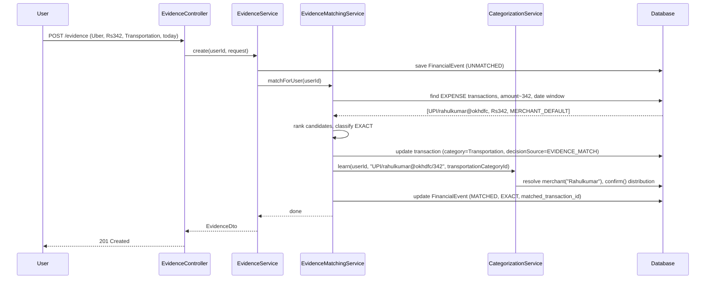

# Finora Financial Evidence Engine — Technical Design

**Status:** Design review draft. No implementation should proceed against this document until it's reviewed and approved.
**Scope:** The Evidence data model, manual evidence capture, and the Evidence Matching Engine that links evidence to transactions — the first concrete slice of `finora-financial-intelligence-philosophy.md`'s "Financial Event vs Financial Transaction" model.

**Relationship to other docs:** This does not replace `financial-intelligence-engine-spec.md` or `rule-engine-relationship-engine-eds.md` — Merchant Resolution, the Rule Engine, Learning, Confidence, and Reconciliation stay exactly as specified and implemented there. Evidence Matching is a new, additive stage that sits inside that same pipeline. This document exists specifically to close `finora-financial-intelligence-philosophy.md` §9's open questions 2–5 (Evidence precedence, confidence tiers, compliance gating, behavioral learning) — see §1 below for how each is resolved. Open question 1 (pre-persistence duplicate/transfer reordering) is untouched by this work and stays deferred to its own milestone, as already decided.

**Per `docs/team-message-financial-intelligence-v1-closeout.md`:** this is the first of three named next steps — "the evidence model, reconciliation with external sources (such as Gmail receipts in the future), and eventually the Financial Knowledge Graph." This document builds the evidence model and manual-entry reconciliation only. External sources and the Knowledge Graph are explicitly out of scope — see §11.

---

## 0. Implementation Status

Nothing in this document is built yet. Every component below is 🔲 **Spec only**.

| Component | Status |
|---|---|
| `financial_events` table + migration (V21) | 🔲 Spec only |
| `FinancialEvent` entity + repository | 🔲 Spec only |
| `EvidenceService` (CRUD: log, list, dismiss, delete) | 🔲 Spec only |
| `EvidenceMatchingService` (matching engine) | 🔲 Spec only |
| Wiring into `TransactionService`/`CsvImportService`/`StatementImportService` write paths | 🔲 Spec only |
| `EvidenceController` + `Evidence.tsx` frontend | 🔲 Spec only |
| Tests for all of the above | 🔲 Spec only |

---

## 1. Resolving the philosophy's open questions

`finora-financial-intelligence-philosophy.md` §9 lists five things it explicitly leaves undecided. This document is scoped to resolve four of them (the ones this milestone touches); the fifth stays out of scope.

| # | Open question | Resolution |
|---|---|---|
| 1 | Duplicate/transfer pre-persistence reordering | **Untouched.** Already flagged in `financial-intelligence-engine-spec.md` §1.1 as its own milestone. Evidence Matching runs as a separate post-persistence pass (§5) and doesn't depend on, or block, that reordering. |
| 2 | Precedence between Rule Engine, Learning Engine, and Evidence Matching | **Resolved — see §5.2.** Evidence Matching runs after Reconciliation, in the same synchronous post-persistence position as `RecurringService`. An `EXACT` match overrides `LEARNED_PATTERN`/`KEYWORD_MATCH`/`MERCHANT_DEFAULT`-sourced categories (it's direct proof, stronger than a guess or statistical pattern) but **never** overrides `USER_RULE`, `GLOBAL_RULE`, or `MANUAL` (a rule or an explicit user choice is deliberate intent — "rules never guess," and evidence doesn't get to overrule a human either). |
| 3 | Gmail Receipts need at least the PDF-parsing compliance gate, arguably stricter | **Resolved — Gmail (and any other external evidence source: SMS, notifications, merchant APIs) is a hard non-goal for this milestone.** This spec builds the evidence model and matching engine against **manual entry only**. `financial_events.source` is an enum with exactly one usable value (`MANUAL`) today; external sources are new enum values a future, separately-gated milestone can add without touching this schema or matching logic — see §11. |
| 4 | High/Medium/Low confidence needs real thresholds | **Partially resolved, deliberately narrow.** This document does not redesign `ConfidenceEngine`'s global auto-apply threshold. It introduces a separate, narrower two-tier concept scoped only to evidence matches — `EXACT` vs `FUZZY` (§5.1) — reusing the same exact-vs-partial tie-break pattern `ReconciliationService`'s refund matching already established, not a new confidence framework. |
| 5 | Behavioral (non-merchant) learning — the Personal QR Code problem | **Out of scope, by the philosophy document's own admission** ("new scope, not an extension"). §5.3 shows how Evidence Matching materially helps this problem today without building a new behavioral-learning entity — worth reading before assuming this is a bigger lift than it is. |

---

## 2. Overall architecture

Evidence Matching slots into the existing pipeline as a new stage after Reconciliation, at the same synchronous, post-persistence position `RecurringService` already occupies:

```
Transaction Source
(CSV / Manual)
        │
        ▼
Merchant Resolution → Rule Engine → Learning Engine   (CategorizationService.suggest — unchanged)
        │
        ▼
Persistence
        │
        ▼
Reconciliation (duplicates, transfers, refunds)         — ReconciliationService, unchanged
        │
        ▼
Recurring Detection                                      — RecurringService, unchanged
        │
        ▼
NEW: Evidence Matching                                    — EvidenceMatchingService
        │
        ▼
Analytics & Dashboard
```

Independently, logging a new piece of evidence (§4) triggers the same matching pass in the other direction — a receipt logged for a purchase made last week must be able to find and match an already-persisted transaction, not just future ones. Both triggers call the same `EvidenceMatchingService.matchForUser(userId)` entry point — see §5.4.

This placement is deliberate: Evidence Matching needs the transaction to already exist (it matches *against* persisted transactions, the same way Reconciliation and Recurring Detection do), so it cannot run inside `CategorizationService.suggest()`, which executes before the transaction being created is saved.

---

## 3. Component responsibilities (new)

| Component | Responsibility | Explicitly NOT responsible for |
|---|---|---|
| **Evidence Store** (`FinancialEvent` entity, `EvidenceService`) | CRUD for a user's logged evidence — a receipt, invoice, booking confirmation, or bill, entered manually with merchant name, amount, date, and category | Matching evidence to transactions (that's the Matching Engine's job), resolving merchant identity (delegates to `MerchantNormalizationEngine`, same as everything else) |
| **Evidence Matching Engine** (`EvidenceMatchingService`, new) | Given a user's unmatched evidence and their transactions, find candidate matches by amount + date proximity, rank them `EXACT`/`FUZZY`, auto-apply `EXACT` matches as a category confirmation, and queue `FUZZY` matches for user review | Categorization math (delegates to `CategorizationService`/`MerchantLearningService`), OCR or parsing of receipt images (no image ingestion this milestone — see §11) |

Both land in the existing `entity`/`repository`/`service`/`controller`/`dto` packages — no new top-level package, consistent with every prior milestone's Non-goals section.

---

## 4. Database design

### 4.1 `financial_events` (new — V21)

```sql
CREATE TABLE financial_events (
    id                      UUID PRIMARY KEY DEFAULT gen_random_uuid(),
    user_id                 UUID NOT NULL REFERENCES users(id) ON DELETE CASCADE,
    source                  VARCHAR(20) NOT NULL DEFAULT 'MANUAL',   -- MANUAL only, usable, this milestone
    event_type              VARCHAR(20) NOT NULL,                     -- RECEIPT | INVOICE | BOOKING | BILL | OTHER
    merchant_name_raw       VARCHAR(255) NOT NULL,                    -- as the user typed it, e.g. "Uber" — see §5.3 on why this is NOT the matching key
    category_id             UUID NOT NULL REFERENCES categories(id),  -- what the user says this evidence is, per resolveOrCreateCategory()
    amount                  NUMERIC(14,2) NOT NULL,
    occurred_at             TIMESTAMPTZ NOT NULL,                     -- when the evidence says the event happened, not when it was logged
    notes                   TEXT,
    match_status            VARCHAR(20) NOT NULL DEFAULT 'UNMATCHED', -- UNMATCHED | MATCHED | DISMISSED
    matched_transaction_id  UUID REFERENCES transactions(id),
    match_confidence        VARCHAR(10),                              -- EXACT | FUZZY, null until matched
    created_at              TIMESTAMPTZ NOT NULL DEFAULT now(),
    updated_at              TIMESTAMPTZ NOT NULL DEFAULT now(),
    deleted_at              TIMESTAMPTZ,
    version                 BIGINT NOT NULL DEFAULT 0
);
CREATE INDEX idx_financial_events_user_status ON financial_events(user_id, match_status);
CREATE INDEX idx_financial_events_matched_txn ON financial_events(matched_transaction_id);
```

`FinancialEvent` extends `BaseEntity` (the same soft-delete + `@Version` base `Transaction`/`Account`/`StatementImport`/`Budget`/`Goal` already use) — this is a real, user-visible, user-deletable record, not internal plumbing like `MerchantAlias`. Its `@SQLDelete` must include `AND version = ?` in the same shape those four entities' comments already document, or it reintroduces the exact "No value specified for parameter 2" bug found and fixed on all of them:

```java
@SQLDelete(sql = "UPDATE financial_events SET deleted_at = now(), version = version + 1 WHERE id = ? AND version = ?")
@SQLRestriction("deleted_at IS NULL")
```

`event_type` is descriptive/display-only this milestone — it helps the user recognize entries in their own evidence list ("Receipt" vs "Bill") and is **not** a matching signal. A future milestone could use it to bias matching (e.g. `BILL` evidence should only match `EXPENSE` transactions on a recurring-looking merchant) but that's speculative until there's a real accuracy problem to justify it — same "defer complexity until justified" principle `financial-intelligence-engine-spec.md` §8 already states.

### 4.2 `transactions.decision_source` (extend — V21)

```sql
-- No column change. This is an enum value addition on the existing Transaction.DecisionSource
-- Java enum, backed by the same VARCHAR(20) column V17 already added.
```

`Transaction.DecisionSource` gains `EVIDENCE_MATCH`, alongside the six existing values. No migration needed for this specifically — the column is already a plain `VARCHAR`, not a Postgres `ENUM` type (confirmed against V17's `ALTER TABLE transactions ADD COLUMN decision_source VARCHAR(20)...`), so adding a Java-side enum constant is the entire change.

### 4.3 Dangling-pointer cleanup (extend `TransactionService`/`StatementImportService`)

This is a direct lesson from a real bug found in this codebase's own review process: `financial_events.matched_transaction_id` is exactly the same shape of pointer as `transactions.refund_of_transaction_id` — a foreign-key-like reference from a row that survives a delete to a row that doesn't. Deleting a matched transaction must reset the evidence back to `UNMATCHED`, the same way deleting the EXPENSE side of a refund pair must reset the INCOME side's `refundOfTransactionId`.

Concretely: `FinancialEventRepository` gets a `findByMatchedTransactionIdIn(List<UUID> ids)` method, and both `TransactionService.clearReconciliationPointersTo()` and `StatementImportService.delete()` — the two places `refundOfTransactionId` cleanup already lives — get one more loop:

```java
for (FinancialEvent e : financialEventRepository.findByMatchedTransactionIdIn(removedIds)) {
    e.setMatchedTransactionId(null);
    e.setMatchConfidence(null);
    e.setMatchStatus(FinancialEvent.MatchStatus.UNMATCHED);
    financialEventRepository.save(e);
}
```

Resetting to `UNMATCHED` (not `DISMISSED`) is deliberate: the evidence is still real, only its transaction was removed (e.g. a re-imported/corrected statement) — it should be eligible to match again on the next pass, exactly like a fresh, never-matched event.

### 4.4 What deleting evidence does *not* do

Deleting or dismissing a `FinancialEvent` never reverts a transaction's `categoryId`/`decisionSource`, and never un-does the `MerchantLearningAudit` entry an `EXACT` match already wrote. Once an evidence match has fed `MerchantLearningService.confirm()`, that confirmation is real evidence about the merchant's distribution (Engineering Principle 3, §9) — removing the evidence *record* doesn't make the *confirmation* untrue, any more than deleting a CSV import file after confirming its rows un-teaches what was learned from them. If a user genuinely believes an evidence-applied category was wrong, the existing, already-correct tool is `PATCH /transactions/{id}/category` (an explicit `MANUAL` correction) — this spec does not add a second, parallel "undo an evidence match" mechanism.

---

## 5. Processing pipeline

### 5.1 Matching algorithm

For each `UNMATCHED` evidence row, `EvidenceMatchingService` searches the same user's `EXPENSE` transactions (evidence in this milestone only models spend-side events — receipts, invoices, bills, bookings; nothing in `finora-financial-intelligence-philosophy.md`'s worked examples is income-side) for candidates:

1. Amount within tolerance: exact match, or within 1% (mirrors `RecurringService`'s existing amount-consistency tolerance pattern rather than inventing a new one).
2. `occurred_at` within a **3-day window** of the transaction's `txnDate` — wider than `ReconciliationService`'s duplicate/transfer windows (same-day/近 settlement isn't guaranteed for UPI or card settlement, and a receipt's timestamp is the purchase moment, not the bank's posting date), narrower than the 180-day refund window (a receipt is evidence of the *original* purchase, not something that can trail it by months the way a refund can).
3. Not already matched (`match_status = UNMATCHED` on the evidence side; the transaction side has no matched-evidence pointer to check, since one transaction could plausibly have multiple evidence rows — e.g. an invoice and a payment confirmation for the same purchase — so no transaction-side exclusivity constraint is enforced).

Among candidates, rank exactly the way `ReconciliationService.isCloserRefundMatch()` already does — reused, not reinvented:

- Exact-amount candidates outrank partial-amount (within-tolerance) candidates.
- Among equally-good matches, the temporally closer transaction wins.

The winning candidate's match is classified:

- **`EXACT`** — amount matches exactly (to the cent) AND `occurred_at`/`txnDate` are within 1 day.
- **`FUZZY`** — amount within tolerance but not exact, OR the date gap is 2–3 days.

### 5.2 What happens on match

**`EXACT`:**
1. `financial_events.match_status = MATCHED`, `matched_transaction_id` set, `match_confidence = EXACT`.
2. If the transaction's current `decisionSource` is `USER_RULE`, `GLOBAL_RULE`, or `MANUAL` — **do nothing to the category.** The match is still recorded (the user can see "this receipt matches this transaction" even when it didn't change the category), but the category itself is untouched. This is the §1 resolution to open question 2.
3. Otherwise (current `decisionSource` is `LEARNED_PATTERN`, `KEYWORD_MATCH`, or `MERCHANT_DEFAULT` — i.e. nothing more authoritative than a guess has claimed this transaction): set `transaction.categoryId = event.categoryId`, `decisionSource = EVIDENCE_MATCH`, `decisionRuleId = null`, `needsCategoryReview = false`, and call `categorizationService.learn(userId, transaction.getDescription(), event.getCategoryId())` — **resolving the merchant from the transaction's own description, not the evidence's `merchant_name_raw`.** See §5.3 for why this specific detail is the whole point.

**`FUZZY`:** recorded (`match_status = MATCHED`, `match_confidence = FUZZY`) but never auto-applied. Surfaced in a review queue (§6, §7) for the user to confirm or reject — confirming applies step 3 above exactly as if it had been `EXACT`; rejecting resets the evidence to `UNMATCHED` (not `DISMISSED` — see §5.4, a rejected candidate might still find a *different*, correct match on a later pass) but excludes that specific transaction from being re-offered as a candidate for this event again.

**No candidate found:** the evidence stays `UNMATCHED`. No error, no user-facing failure — most evidence won't match on the first pass if it's logged before the transaction is imported (see §5.4).

### 5.3 Worked example — why this actually helps the Personal QR Code problem

This is the exact scenario `finora-financial-intelligence-philosophy.md` opens with:

> `UPI / Rahul Kumar / ₹342` — Was this Uber? A friend? Groceries?

Suppose the user logs evidence: merchant "Uber", ₹342, today, category "Transportation". Their bank statement later imports a transaction: description `UPI/rahulkumar@okhdfc/342`, ₹342, same day. `MerchantNormalizationEngine.resolve()` on that description resolves to a merchant identity like "Rahulkumar" — a completely different identity than "Uber," because the philosophy's whole premise is that the bank statement doesn't say "Uber" anywhere.

Evidence Matching finds the amount+date match, classifies it `EXACT`, and — critically — calls `categorizationService.learn(userId, "UPI/rahulkumar@okhdfc/342", transportationCategoryId)`. That resolves and teaches the **"Rahulkumar" merchant identity** (the one the bank statement will keep showing), not "Uber" (which the bank statement will never say again). `merchant_name_raw` ("Uber") is stored purely as human-readable context on the evidence row — it is never passed to `MerchantNormalizationEngine` for learning purposes.

Next month, a different ₹350-ish UPI payment to the same "Rahul Kumar" personal handle arrives — a different Uber ride, this time with no receipt logged at all. `CategorizationService.suggest()` now finds a learned distribution for the "Rahulkumar" merchant identity pointing at Transportation, from last month's evidence-backed confirmation, and can categorize it correctly without asking. **One receipt, logged once, permanently improves every future transaction to the same personal UPI handle** — without building a new behavioral/amount-range learning engine at all. This is why open question 5 (behavioral learning) is genuinely separate, non-blocking scope: Evidence Matching solves a meaningful slice of the Personal QR Code problem today by reusing the existing merchant-identity learning infrastructure, not by inventing a new one.

### 5.4 Triggers

Both directions call the same `EvidenceMatchingService.matchForUser(userId)`:

| Trigger | Where |
|---|---|
| New evidence logged | `EvidenceService.create()`, immediately after save |
| Transaction created (manual) | `TransactionService.create()`, alongside the existing `reconciliationService.reconcileForUser()` / `recurringService.detectForUser()` calls |
| Transaction updated (amount/date can change what matches) | `TransactionService.update()`, same position |
| CSV batch imported | `CsvImportService.confirm()`, same position as its existing reconciliation/recurring calls |

Matching a whole user's unmatched evidence against a whole user's transactions on every write is the same "fine at personal-finance volumes, revisit only if measured otherwise" tradeoff `RecurringService`'s own doc comment already accepts for the identical reasoning — not re-litigated here.

Deleting a transaction does **not** trigger a matching pass (there's nothing new to match — see §4.3 for what it does do: cleanup, not re-matching).

---

## 6. API surface

| Method | Path | Notes |
|---|---|---|
| `POST /api/v1/evidence` | Log new evidence (`merchantNameRaw`, `eventType`, `categoryName`, `amount`, `occurredAt`, `notes`) — `categoryName` resolved via the existing `resolveOrCreateCategory()`, same as every other category-name-accepting endpoint | Triggers matching immediately (§5.4) |
| `GET /api/v1/evidence` | List the caller's evidence, filterable by `matchStatus` | |
| `GET /api/v1/evidence/{id}` | Detail, including the matched transaction summary if `MATCHED` | |
| `DELETE /api/v1/evidence/{id}` | Soft-delete (§4.4 — does not touch the matched transaction) | |
| `POST /api/v1/evidence/{id}/dismiss` | Marks `DISMISSED` without deleting — "I don't have a transaction for this, stop trying to match it" | Excluded from future matching passes |
| `GET /api/v1/evidence/matches/pending` | `FUZZY`-matched evidence awaiting user review, paired with their candidate transaction | Backs the review queue (§7) |
| `POST /api/v1/evidence/{id}/confirm-match` | Body: `transactionId`. Applies §5.2 step 3 as if the match were `EXACT` | |
| `POST /api/v1/evidence/{id}/reject-match` | Body: `transactionId`. Resets to `UNMATCHED`, excludes that transaction as a future candidate for this event | |

All new endpoints follow the existing `/api/v1/...` convention and thin-controller/service-layer split.

---

## 7. UI/UX specification

### 7.1 Evidence log (`Evidence.tsx`, new page)

A simple form (merchant name, category, amount, date/time, notes, event type dropdown) plus a list of the user's logged evidence with a status badge (`Unmatched` — grey, `Matched` — green with a link to the matched transaction, `Dismissed` — muted). Reuses the existing indigo/sidebar design system and card-based layout, same as every other page (§6.5 precedent in `financial-intelligence-engine-spec.md`) — no new visual language introduced.

### 7.2 Review queue

A small card, surfaced on the Dashboard or Ledger (exact placement is a product call, not fixed by this spec) alongside the existing `AskOnceCard`, listing pending `FUZZY` matches: "Your Uber receipt (₹342, today) might match this transaction — UPI/rahulkumar@okhdfc, ₹342, today" with Confirm/Reject actions. This is a *different* review surface than `AskOnceCard` (that one asks "what category is this," this one asks "is this the right transaction for this receipt") and should not be merged into one component just because both are review queues — same "no unnecessary abstraction" principle that already keeps duplicate/transfer detection in one service specifically *because* they share data, not because all review-shaped UI should share a component.

### 7.3 Transaction detail

Where a transaction shows its category/decision source today, a transaction with `decisionSource = EVIDENCE_MATCH` or any `MATCHED` evidence pointing at it (regardless of whether the match changed the category — see §5.2 step 2) shows a small "Backed by evidence" indicator linking to the evidence entry. This is the first visible edge of what the closeout memo calls the eventual Financial Knowledge Graph — see §11.

---

## 8. Sequence diagram

### 8.1 Evidence logged after the transaction already exists



---

## 9. Engineering principles (continuity with existing 7)

The seven principles in `financial-intelligence-engine-spec.md` §8 are unchanged and this document adds none new — the same discipline just gets applied here:

- **Reuse, don't reinvent** (Principle 5, sharpened): `EXACT`/`FUZZY` ranking reuses `ReconciliationService`'s refund tie-break exactly; matching wires through the *existing* `CategorizationService.learn()`/`MerchantLearningService.confirm()` path rather than a parallel evidence-specific learning mechanism; dangling-pointer cleanup extends the *existing* `clearReconciliationPointersTo()` method rather than a new cleanup pass.
- **Learning attaches to the transaction's own merchant identity, never the evidence's** (§5.3) — this is the one genuinely new architectural rule this document introduces, and it's load-bearing enough to restate outside its own subsection.
- **Evidence is corroborating, not authoritative over explicit intent** (§1, question 2) — `MANUAL` and rule-sourced categories are never silently overwritten by a match, consistent with how every other write path in this codebase already treats `MANUAL` as terminal.
- **Deleting a record doesn't un-teach what it already taught** (§4.4) — consistent with "audit trails are append-only" (existing Principle 7).

---

## 10. Failure & recovery

| Scenario | Expected behavior | Recovery strategy |
|---|---|---|
| Merchant resolution fails during an `EXACT` match's `learn()` call | Same as the existing "Merchant resolution fails" row (`financial-intelligence-engine-spec.md` §10) — the whole match attempt for that event fails, evidence stays `UNMATCHED` | Retry is safe; resolution is idempotent. Next matching pass (triggered by any future write) retries automatically |
| Matching query times out (large evidence/transaction set) | Fail closed — affected evidence rows stay `UNMATCHED`, nothing partially applied | Log at WARN, same as the existing duplicate-detection-timeout row. Retried on the next trigger, no data at risk since nothing is mutated until a full candidate is selected |
| User confirms a `FUZZY` match, but another `EXACT` match for the same evidence was found on a later pass | Cannot happen by construction — an evidence row leaves `UNMATCHED` (and stops being a matching candidate) the moment it's `MATCHED`, `FUZZY` or not | N/A |
| Transaction deleted while evidence points at it | `matched_transaction_id`/`matchConfidence` reset to null, `matchStatus` reset to `UNMATCHED` — see §4.3 | Automatic, part of the same delete transaction; no separate recovery step |

---

## 11. Non-goals for this milestone

- **Gmail, SMS, notification, or any external evidence source.** `financial_events.source` ships with exactly one usable value, `MANUAL`. A Gmail connector needs — at minimum — the same DPDP Act 2023 compliance review `statement-intelligence-engine-spec.md` already requires for PDF parsing, arguably a stricter one given inbox OAuth scopes, retention, and consent are a bigger trust surface than an uploaded file. That review is not part of this document and must happen before any external-source work begins.
- **Receipt image upload / OCR / AI extraction.** Evidence is structured manual entry only this milestone — merchant name, amount, date, category typed by the user. Parsing an uploaded photo or forwarded email into those fields is a real, separate capability with its own accuracy and cost tradeoffs, not bundled in here.
- **Behavioral (non-merchant) learning.** Amount-range/day-of-week pattern learning for payees with no matched evidence at all is explicitly out of scope — per the philosophy document itself, it needs its own entity and service, not an extension of this one. §5.3 shows this milestone still meaningfully helps the same underlying problem without it.
- **Redesigning `ConfidenceEngine` into a global three-tier (High/Medium/Low) model.** `EXACT`/`FUZZY` is a narrow, evidence-match-specific concept, not a replacement for `DEFAULT_AUTO_APPLY_THRESHOLD`'s binary math elsewhere in the system.
- **Pre-persistence duplicate/transfer reordering.** Already its own deferred milestone; unaffected by and unrelated to this work.
- **The Financial Knowledge Graph itself.** This document builds the first real edge of that graph — Evidence↔Transaction — and surfaces it as a simple link in the UI (§7.3). A generalized graph query/traversal layer, or linking further node types (relationships, receipts-of-receipts, reports), is the "eventually" the closeout memo names, not this milestone.

---

## 12. Acceptance criteria (per milestone)

**Milestone A — Evidence data model + manual capture**
- `financial_events` migration (V21) applied; `FinancialEvent` entity uses the correct `@SQLDelete`/`@Version` shape (§4.1) — a test confirms delete doesn't throw "No value specified for parameter 2."
- `EvidenceService` create/list/get/dismiss/delete all work and are user-scoped (404, not another user's row, on cross-user access — same convention as `MerchantService.requireOwnedMerchant()`).
- `categoryName` on evidence creation resolves via the existing `resolveOrCreateCategory()` — no duplicate category-resolution logic.

**Milestone B — Matching engine**
- `EvidenceMatchingService` correctly classifies `EXACT` vs `FUZZY` per §5.1's thresholds, with tests covering: exact amount + same day, exact amount + 2-day gap (`FUZZY`), 1%-tolerance amount + same day (`FUZZY`), amount outside tolerance (no match), date outside the 3-day window (no match).
- An `EXACT` match on a `MERCHANT_DEFAULT`/`KEYWORD_MATCH`/`LEARNED_PATTERN`-sourced transaction updates its category and `decisionSource = EVIDENCE_MATCH`; the identical match on a `MANUAL`/`USER_RULE`/`GLOBAL_RULE`-sourced transaction records the match but leaves the category untouched — both covered by explicit tests, not just the happy path.
- `learn()` is called with the **transaction's** description, never the evidence's `merchant_name_raw` — a regression test analogous to §5.3's worked example, resolving to a different merchant identity than the evidence's raw text would, and asserting the transaction's own merchant learned the confirmation.
- `findByMatchedTransactionIdIn` cleanup is wired into both `TransactionService.clearReconciliationPointersTo()` and `StatementImportService.delete()`, with tests mirroring the existing refund-pointer regression tests (`delete_clearsRefundPointer_onSurvivingTransaction`, `StatementImportServiceDeleteTest`) for the evidence case specifically.

**Milestone C — Review queue + frontend**
- `GET /evidence/matches/pending`, `confirm-match`, `reject-match` all work per §6.
- `Evidence.tsx` ships: log form, evidence list with status badges, review queue card.
- No changes to any existing endpoint's request/response shape — this milestone is purely additive, same convention every prior milestone in this codebase has held to.
