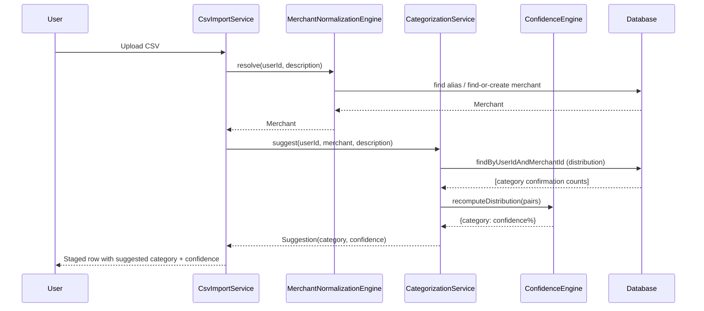
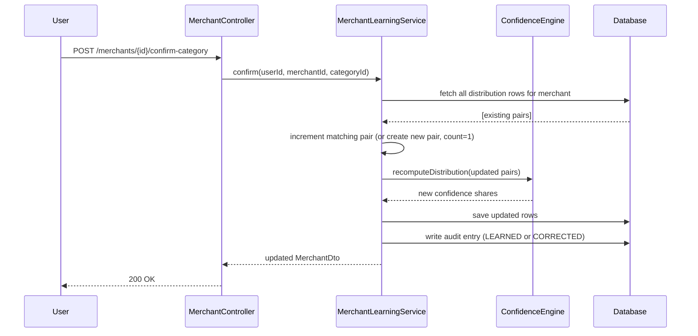
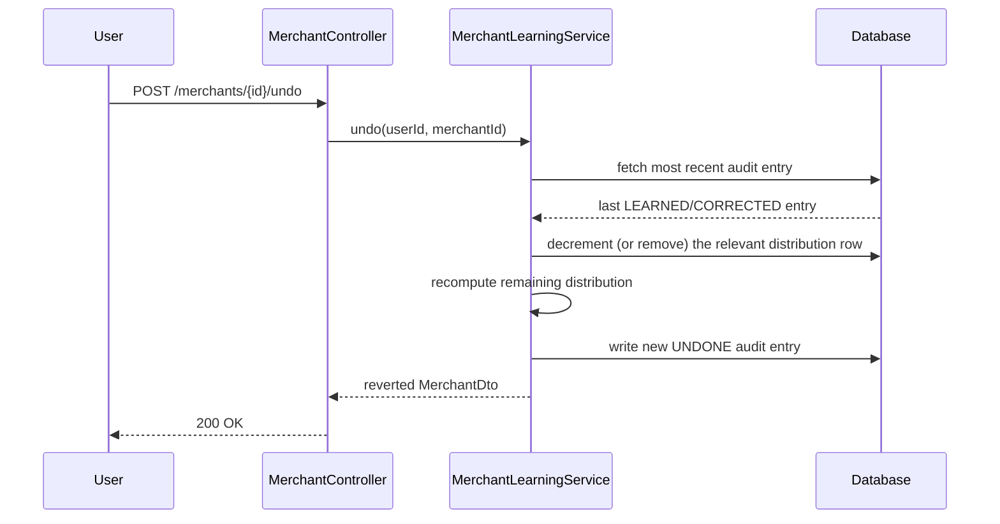

# Finora Financial Intelligence Engine — Technical Specification

**Status:** Design review draft. No new implementation should proceed against this document until it's reviewed and approved.
**Scope:** Merchant Resolution, Categorization, Confidence, Learning, Duplicate/Recurring Detection, Analytics — as one cohesive engine, not a collection of loosely related features.

---

## 0. Implementation Status (read this first)

This spec covers both work that's already built and work that's still design-only. Every component below is tagged:

- ✅ **Implemented** — real code exists, migrated, and (where noted) tested
- 🔲 **Spec only** — described here, not yet built

| Component | Status |
|---|---|
| `Merchant`, `MerchantAlias`, `MerchantCategoryLearning`, `MerchantLearningAudit` entities + migration (V7) | ✅ Implemented |
| `MerchantNormalizationEngine` (alias resolution) | ✅ Implemented |
| `ConfidenceEngine` (distribution-based scoring) | ✅ Implemented |
| `MerchantLearningService` (confirmations, conflict handling, audit, undo) | 🔲 Spec only |
| `MerchantService` (list, merge, rename) | 🔲 Spec only |
| Rewiring `CategorizationService` / `TransactionService` / `CsvImportService` onto the new engine | 🔲 Spec only |
| `AnalyticsService` | 🔲 Spec only |
| Merchant controllers/endpoints | 🔲 Spec only |
| `Merchants.tsx` frontend (review dashboard, merge, undo) | 🔲 Spec only |
| Tests for all of the above | 🔲 Spec only |

Everything already marked ✅ is treated as a constraint on this spec, not something up for redesign again — it went through one real revision already (single-category-per-merchant → distribution-based) before any dependent code was built on top of it, which is exactly why that revision was cheap. Re-opening it a second time would not be.

---

## 1. Overall Architecture

The Financial Intelligence Engine is the single processing pipeline every transaction passes through, regardless of where it came from. A CSV upload, a future Gmail-fetched statement, a future Open Banking feed, and a manually-entered transaction all converge on the same pipeline — the only thing that varies per source is how raw data gets turned into a `(date, description, amount, type, account)` tuple before it enters the pipeline.

```
Transaction Source
(CSV / PDF / Gmail / Manual / Open Banking)
        │
        ▼
Merchant Resolution        — "who is this merchant?"
        │
        ▼
Duplicate Detection        — "have we already recorded this exact transaction?"
        │
        ▼
Categorization              — "which category, using merchant history + rules?"
        │
        ▼
Confidence Calculation      — "how sure are we?"
        │
        ▼
Recurring Detection         — "does this look like a subscription/EMI/rent?"
        │
        ▼
Learning Engine              — "record this decision as evidence for next time"
        │
        ▼
Persistence
        │
        ▼
Analytics & Dashboard
```

### 1.1 Known gap between this diagram and current implementation

Being direct about this rather than glossing over it: **duplicate detection does not currently run as a pre-persistence gate.** Today, `ReconciliationService.reconcileForUser()` runs as a full-table pass *after* transactions are saved, flagging duplicates retroactively via `isDuplicateOf`. This spec's target pipeline runs duplicate detection *before* categorization, so a detected duplicate never gets categorized or learned from at all — cheaper and more correct. Moving to a true pre-persistence check requires `ReconciliationService.findPotentialDuplicates()` to run per-incoming-row during import/creation rather than as a post-hoc batch pass. This is real, non-trivial rework of existing tested code, not a drop-in change, and should be its own milestone (see §9) rather than bundled silently into the merchant intelligence work.

---

## 2. Component Responsibilities

Each component has exactly one job. None of them know how to do each other's job — that's the point of separating them.

| Component | Responsibility | Explicitly NOT responsible for |
|---|---|---|
| **Merchant Resolution** (`MerchantNormalizationEngine`) | Given a raw description, resolve to a canonical `Merchant` (exact alias match → first-significant-token heuristic → create new) | Categorization. A merchant has no opinion on what category it belongs to. |
| **Duplicate Detection** (`ReconciliationService`, duplicate half) | Given account+date+amount+description, determine if this transaction already exists | Categorization, transfer detection |
| **Transfer Detection** (`ReconciliationService`, transfer half) | Match opposite-direction transactions across accounts within a time/amount window | Duplicate detection (kept as one service today since both operate over the same transaction set in one pass — see §8 on avoiding premature splitting) |
| **Categorization Engine** (`CategorizationService`) | Given a merchant's learned distribution + keyword rules, suggest a category | Storing the distribution itself, computing confidence math, or deciding auto-apply vs. review (that's Confidence Engine's job) |
| **Confidence Engine** (`ConfidenceEngine`) | Pure functions: given a distribution of confirmation counts, compute each category's % share and whether the top share clears the auto-apply threshold | Persisting anything. Stateless by design — it's given data, it returns numbers. |
| **Learning Engine** (`MerchantLearningService`) | Record a user's category confirmation for a merchant: update the distribution, write an audit entry, support undo | Deciding what confidence means (delegates to Confidence Engine) or what merchant a transaction belongs to (delegates to Merchant Resolution) |
| **Recurring Detection** (`RecurringService`) | Flag transactions with regular interval + consistent amount per merchant | Categorization, duplicate detection |
| **Analytics Engine** (`AnalyticsService`) | Read-only aggregations over already-persisted data | Any mutation. Analytics never writes. |

---

## 3. Database Design

### 3.1 Entity relationships

```
User
 │
 ├── Account (savings/card/wallet/investment)
 │
 ├── Category (per-user category list, includes system defaults)
 │
 ├── Merchant ──────────────┬── MerchantAlias (many aliases → one merchant)
 │                          │
 │                          ├── MerchantCategoryLearning (one row per merchant+category pair —
 │                          │    the distribution: Amazon/Shopping/147, Amazon/Electronics/34, ...)
 │                          │
 │                          └── MerchantLearningAudit (append-only history of every
 │                               LEARNED/CORRECTED/UNDONE/MERGED event for this merchant)
 │
 └── Transaction ── optionally resolves to one Merchant (merchant_id, nullable —
                     nullable because pre-existing transactions predate this feature
                     and manual entries may not always resolve cleanly)
```

### 3.2 Table purposes

| Table | Purpose |
|---|---|
| `merchants` | Canonical merchant identity: display name, optional logo/website (manually entered — see §3.4) |
| `merchant_aliases` | Every raw normalized description string that resolves to a merchant. Unique per `(user, normalized_alias)` — one alias can't point at two merchants. |
| `merchant_category_learning` | The distribution. One row per `(user, merchant, category)`. `confirmation_count` is the real evidence; `confidence` is that row's cached % share of the merchant's total confirmations, recomputed whenever any row for that merchant changes. |
| `merchant_learning_audit` | Append-only. Every confirmation, correction, undo, and merge, ever. This is what makes "undo" and "why is this categorized this way" answerable. |
| `merchant_category_map` *(legacy, superseded)* | The pre-merchant-intelligence system (one row per raw normalized description → category, no merchant identity, no distribution). **Left in place, not migrated** — see §3.5. |

### 3.3 Data flow

A transaction's `merchant_id` is set once at resolution time and doesn't change on its own — if a user merges two merchants later, transactions already pointing at the "losing" merchant get repointed to the "surviving" one as part of the merge operation (see §5.4), not left dangling.

### 3.4 Future extensibility, without building it now

- `merchants.logo_url` / `merchants.website` exist as nullable columns today specifically so a future enrichment step (e.g. a Clearbit-style API) has somewhere to write to — but no such integration exists yet, and the only way to populate these fields today is manual entry through the merchant edit UI (§6.1). Do not build speculative enrichment-API integration code against these columns until a real provider and API key are actually in hand.
- The distribution model (`merchant_category_learning`) has room to add a `source` column later (e.g. distinguishing "confirmed via CSV review" vs "confirmed via manual edit") if that distinction ever becomes useful for confidence weighting — not built now because there's no current use for it.

### 3.5 Why `merchant_category_map` isn't migrated

Auto-migrating existing `(normalized_description → category)` rows into the new merchant/alias/distribution model would require guessing, for every historical row, which merchant it should have belonged to — using the same first-significant-token heuristic that's explicitly documented as imperfect (§4, Merchant Resolution). Getting this wrong silently for historical data is worse than leaving old data on the old table and starting the new model fresh going forward. If backfilling is ever wanted, it should be a deliberate, reviewable, one-time script — not baked into this migration.

---

## 4. Processing Workflow (canonical pipeline, target state)

1. **Resolve merchant** — `MerchantNormalizationEngine.resolve(userId, description)`. Exact alias match first; else first-significant-token heuristic against existing merchants; else create new merchant + alias.
2. **Check duplicates** — against existing transactions for this account/date/amount/description (see §1.1 — not yet a true pre-persistence gate today).
3. **Retrieve merchant's learning distribution** — `MerchantCategoryLearningRepository.findByUserIdAndMerchantId()`, giving every category this merchant has been confirmed under and its confirmation count.
4. **Calculate confidence** — `ConfidenceEngine.recomputeDistribution()` turns confirmation counts into % shares; `topCategory()` picks the leading one.
5. **Auto-categorize if confidence ≥ threshold** (default 90, configurable via `app.categorization.auto-apply-threshold`) — apply the top category, no user interaction.
6. **Otherwise, route to review** — set `needsCategoryReview = true` (this flag and its UI already exist — see the "Ask Once, Learn Forever" work from the previous milestone).
7. **Learn from user confirmation** — `MerchantLearningService.confirm(userId, merchantId, categoryId)`: increments that pair's `confirmation_count`, recomputes the whole distribution's confidence shares, writes a `LEARNED` or `CORRECTED` audit entry (CORRECTED if the confirmed category differs from what was previously the top pick — this is evidence-based conflict detection, not a separate "conflict" state machine).
8. **Update analytics** — no explicit "refresh" step needed; `AnalyticsService` methods compute on read from current data, not from a cached/batched summary (revisit only if read performance ever actually demands precomputation).

---

## 5. API Contracts (new endpoints — spec only, none of these exist yet)

All responses use the existing `ApiResponse<T>` envelope (`success`, `message`, `data`, `timestamp`, `errorCode`, `requestId`) — no new envelope shape.

### 5.1 List merchants
`GET /api/v1/merchants`
```json
{
  "success": true, "data": [
    {
      "id": "uuid", "canonicalName": "Amazon", "logoUrl": null, "website": null,
      "topCategory": "Shopping", "topCategoryConfidence": 76,
      "distribution": [
        { "category": "Shopping", "confirmationCount": 147, "confidence": 76 },
        { "category": "Electronics", "confirmationCount": 34, "confidence": 18 },
        { "category": "Books", "confirmationCount": 12, "confidence": 6 }
      ]
    }
  ]
}
```

### 5.2 Merchant detail + audit history
`GET /api/v1/merchants/{id}`
`GET /api/v1/merchants/{id}/audit` → list of `{ action, previousCategory, newCategory, createdAt }`, newest first.

### 5.3 Update merchant (rename / manual logo+website entry)
`PATCH /api/v1/merchants/{id}`
```json
{ "canonicalName": "Amazon", "website": "https://amazon.in" }
```

### 5.4 Merge two merchants
`POST /api/v1/merchants/{id}/merge`
```json
{ "mergeFromMerchantId": "uuid-of-the-one-being-absorbed" }
```

Explicit merge behavior, in order, so there's no ambiguity during implementation:

1. All aliases belonging to `mergeFromMerchantId` are repointed to `{id}` (the surviving merchant).
2. All transactions with `merchant_id = mergeFromMerchantId` are repointed to `{id}`.
3. Distribution rows (`merchant_category_learning`) for the same category on both merchants are **summed**, not replaced — if the surviving merchant has Shopping/147 and the absorbed one has Shopping/23, the result is Shopping/170, not 147 or 23.
4. Confidence values for every category in the merged distribution are immediately recomputed from the new, combined confirmation counts (via `ConfidenceEngine.recomputeDistribution()` — the same function used everywhere else, not special-cased merge math).
5. The API response returns the **freshly recomputed** distribution for the surviving merchant, not a stale pre-merge snapshot.
6. A single `MERGED` audit entry is written on the surviving merchant (not on the absorbed one, which is about to be deleted).
7. The absorbed merchant row (`mergeFromMerchantId`) is deleted only after steps 1–6 complete successfully — see §10.4 for what happens if the merge fails partway through.

### 5.5 Confirm a category (the "Ask Once" resolution)
`POST /api/v1/merchants/{merchantId}/confirm-category`
```json
{ "categoryId": "uuid", "applyToTransactionId": "uuid-of-the-specific-transaction-being-resolved" }
```
This replaces the current `PATCH /transactions/{id}/category` for merchant-resolved transactions — it updates the transaction's category *and* calls `MerchantLearningService.confirm()`. Transactions with no resolved merchant fall back to the existing simpler endpoint.

### 5.6 Undo the last learning event
`POST /api/v1/merchants/{id}/undo`
Reverts the merchant's most recent `merchant_learning_audit` entry: decrements the relevant `confirmation_count` (or removes the row if it drops to zero), recomputes the distribution, writes an `UNDONE` audit entry (undo is itself audited — you can't erase history, only add to it).

### 5.7 Analytics
`GET /api/v1/analytics/merchants?view=topMerchants|trend|newMerchants|subscriptions|categoryConfidence|growth&month=2026-07`

One endpoint, one query param selecting which `AnalyticsService` method backs the response — not eight separate endpoints (per the explicit design decision in §8).

---

## 6. UI/UX Specification

### 6.1 Merchant Review Dashboard (`Merchants.tsx`)
A table: merchant name, top category + confidence badge (color-coded: green ≥90%, amber 60–89%, red <60%), confirmation count, last confirmed date. Row actions: change category (dropdown, triggers §5.5), edit name/website (opens §5.3 form inline), merge (see below), view audit history (opens a side panel listing §5.2's response).

### 6.2 Ask Once, Learn Forever — updated
The existing `AskOnceCard` (already shipped) gains a confidence % badge next to the suggested category, and — only when confidence is genuinely borderline (e.g. 40–89%, not just "always") — a one-line "why am I being asked" hint: *"Amazon has been Shopping 76% of the time — is this one too?"* rather than a bare category dropdown with no context.

### 6.3 Merchant merge flow
Two-step: (1) select a second merchant from a searchable list, (2) preview screen showing the combined alias list and combined distribution *before* confirming — merging is destructive to the absorbed merchant's row, so the preview step is not optional.

### 6.4 Undo
A single "Undo last change" button on the merchant detail view, with a confirmation dialog showing exactly what will be reverted (from §5.2's audit response) before it happens — no silent undo.

### 6.5 Analytics views
Reuse the existing dashboard visual language (indigo/sidebar design system, card-based KPIs, Chart.js) rather than introducing a new visual style for this one section — top merchants as a ranked list, trend as a line chart, category confidence as a horizontal bar per category.

---

## 7. Sequence Diagrams

### 7.1 Statement import → merchant resolution → categorization


### 7.2 User confirmation → learning update


### 7.3 Undo


*(Recurring detection and analytics refresh don't get their own sequence diagrams — both are stateless read-time computations over existing data with no multi-step interaction to diagram; a diagram would just be "call one method, get a result.")*

---

## 8. Engineering Principles

1. **One pipeline, every source.** CSV, manual entry, and any future connector (Gmail, Outlook, Open Banking) all produce the same `(date, description, amount, type, account)` shape and feed the same pipeline. Connector-specific logic stops at "parse raw input into that shape" — it never reaches into categorization, learning, or analytics.
2. **Merchant identity is separate from categorization.** `Merchant` answers "who," never "what category." This was a real revision made mid-build (single-category → distribution model) specifically to keep this separation honest, not just structural.
3. **Learning is distribution-based, not single-value.** A merchant's category is evidence (confirmation counts across possibly multiple categories), not a mutable label.
4. **Confidence is derived, not assigned.** No arbitrary incrementing formulas — confidence is always a computed share of real confirmation counts.
5. **No unnecessary abstraction.** Duplicate and transfer detection stay in one `ReconciliationService` because they operate over the same data in one pass — splitting them now would be organizational tidiness with no functional benefit. Merchant matching stays as one method in `MerchantNormalizationEngine`, not a pluggable `Strategy` interface, until a second real matching strategy exists to justify one.
6. **Defer multi-signal confidence until single-signal proves insufficient.** Confirmation-count-based confidence is the whole model for now. Description similarity, amount patterns, and other signals are real future extensions, not current scope — building them now would be tuning weights against a problem that hasn't been shown to exist.
7. **Audit trails are append-only.** Undo adds a new `UNDONE` entry; it never deletes history.

**Note on §9–§10 (added in this revision):** neither the Transaction Processing Context nor the Failure & Recovery scenarios introduce a new abstraction layer, a new persisted entity, or new infrastructure. The context is a plain in-memory data carrier (principle 5 — no unnecessary abstraction); failure handling is specified per-stage according to each stage's actual risk profile rather than a generic framework (same principle); and processing metadata deliberately reuses/reconciles with `Transaction.source` rather than introducing a second taxonomy (principle 6 — defer complexity until justified). These principles remain unchanged from the original draft.

---

## 9. Transaction Processing Context & Processing Metadata

### 9.1 Transaction Processing Context

An in-memory object threaded through the pipeline stages during a single transaction's processing — **not a new database entity or table**. Its purpose is to replace passing 5–6 independent parameters between pipeline stages with one coherent object, which keeps the pipeline easy to extend (a new stage just reads/adds a field on the context) without touching every stage's method signature.

```java
record TransactionProcessingContext(
    // Input
    RawTransactionInput original,       // date, description, amount, type, account — pre-pipeline shape
    ProcessingMetadata metadata,        // see 9.2

    // Populated as the pipeline runs
    Merchant resolvedMerchant,
    boolean isDuplicate,
    String suggestedCategory,
    int confidence,
    boolean isRecurring,
    boolean needsReview
) {}
```

This is a plain data-carrier used within a single request/import-row's processing lifetime — it is not persisted, not passed between HTTP requests, and not a replacement for the real entities (`Transaction`, `Merchant`, etc.) that do get persisted. Each pipeline stage (§4) takes the context, reads what it needs, and returns an updated context (or, in a mutable-builder style if preferred at implementation time — that's an implementation choice, not a spec requirement) rather than reaching into five different method parameters.

### 9.2 Processing Metadata

```java
record ProcessingMetadata(
    Instant processedAt,
    String pipelineVersion,   // e.g. "1.0" — bump when the pipeline's stage order or logic changes materially
    String processingSource   // see note below
)
```

**Reconciling `processingSource` with what already exists:** `Transaction.source` (the existing `MANUAL | CSV_IMPORT` enum) already captures most of what "processing source" means today. `ProcessingMetadata.processingSource` is the same concept, just available to every pipeline stage via the context rather than only being a persisted column read after the fact — and it's specified as a plain `String` rather than reusing the `Transaction.Source` enum directly, specifically so that *future* connectors (Gmail, Open Banking) can be added as new source values without requiring an enum change to ship alongside every new connector. When `Transaction.source` is eventually extended to more values, `processingSource` and `Transaction.source` should stay the same set of allowed values — this metadata is not a second, divergent taxonomy.

**Persistence:** none of `ProcessingMetadata`'s fields are persisted as new columns in this spec. `processedAt` is redundant with `Transaction.createdAt` (already persisted); `pipelineVersion` and `processingSource` are useful for structured logging (via the existing correlation-ID logging pattern — see the "Architecture hardening" sections of the main README) during a single processing run, not for long-term storage. If a future need arises to query "which pipeline version processed this transaction" after the fact, that's a deliberate, reviewable schema addition at that time — not built speculatively now.

---

## 10. Failure & Recovery

The specification so far has focused on the happy path. This section defines behavior when something goes wrong, so implementation doesn't have to improvise error handling stage by stage.

| Scenario | Expected behavior | User experience | Logging | Recovery strategy | Rollback or continue? |
|---|---|---|---|---|---|
| **Merchant resolution fails** (e.g. DB error during alias lookup/creation) | The whole transaction fails to process — a transaction with no resolved merchant can't be categorized or learned from meaningfully | For CSV import: that row is skipped and reported in the import summary ("N rows failed to process"), not silently dropped. For manual entry: the create request fails with a clear error, nothing is half-saved. | Log at ERROR with the correlation ID, raw description, and userId — this is the one failure mode that should never happen silently, since every downstream stage depends on it | Retry is safe (resolution is idempotent — re-running it against the same description either finds the alias that was actually created or creates it cleanly) | Rollback — no transaction row should be persisted without a resolved merchant |
| **Duplicate detection cannot be completed** (e.g. query timeout) | Fail closed toward *not* silently importing a possible duplicate | Row is flagged for manual review rather than auto-imported, with a distinct message ("Couldn't verify this wasn't a duplicate — please check manually") rather than being conflated with a normal low-confidence review flag | Log at WARN — this is a degraded-but-recoverable condition, not a hard failure | User can manually confirm import after review | Continue gracefully, but into a review queue, not straight into the ledger |
| **Learning update fails after a transaction has already been categorized** | The transaction's category assignment is NOT rolled back — a user seeing "category updated" and then having it silently revert is worse than a category being applied without its learning side-effect completing | UI shows the category as updated (it was); a background retry (or, at minimum, a logged failure for manual reconciliation) handles the learning-table update separately | Log at ERROR with merchantId, categoryId, userId — this is the one place where "the transaction succeeded but a side-effect didn't" needs to be loudly visible, since it's silent data drift otherwise | Retry the learning update specifically (it's idempotent — re-running `confirm()` for the same merchant+category either increments correctly or, if it partially applied, is safe to re-run) | Do NOT rollback the category change. Do retry/flag the learning update. These are two different failure domains and should be handled as two different problems, not one transaction. |
| **Merchant merge fails midway** (e.g. fails after repointing aliases but before repointing transactions) | The entire merge operation runs in a single database transaction (`@Transactional`) — partial merges (some aliases repointed, transactions not) must not be observable as a persisted state | User sees a clear "merge failed, nothing was changed" error, not a partially-merged merchant | Log at ERROR with both merchant IDs and which step was in progress when it failed | User can retry the merge from scratch — since nothing partial was committed, retrying is safe and idempotent | **Full rollback.** This is the one operation in this spec where "continue gracefully" is explicitly wrong — a half-merged merchant (some transactions pointing at a merchant row that's about to be deleted) is a worse state than the merge simply not having happened. |
| **Invalid or partially corrupted import rows** (already partially handled by existing CSV staging) | Unparseable rows (bad date, non-numeric amount) are excluded from the staged preview, same as today — this spec doesn't change that existing, working behavior | The import summary already distinguishes "imported" from "skipped" counts; extend "skipped" reasons to include pipeline-stage failures (merchant resolution failure, etc.), not just parse failures | Log at INFO per skipped row (expected/routine, not an error) with the specific skip reason | No automatic recovery — the user re-exports/fixes the source data and re-uploads | Continue gracefully — one bad row must never block the rest of a statement from importing |
| **Analytics service unavailable** (e.g. a query times out under load) | Analytics is read-only and derived from already-persisted data (§8, principle: "Analytics never writes") — its unavailability can never corrupt or block anything else in the pipeline | Dashboard shows a clear "couldn't load this view right now" state for the affected widget only, not a full-page failure | Log at WARN, not ERROR — a slow/failed analytics read is degraded UX, not a data-integrity problem | Retry on next page load / manual refresh; no special recovery needed since nothing was mutated | Continue gracefully — by construction, there's nothing to roll back |

**General principle across all of the above:** failures are categorized by whether they represent a *data-integrity risk* (merchant resolution, merge — these get strict rollback) versus a *degraded-but-safe* condition (analytics, duplicate-check timeout — these get graceful continuation into a safer fallback state). Nothing in this table introduces a new abstraction (no generic "failure handler" framework) — each stage handles its own failure mode according to its own risk profile, consistent with Engineering Principle 5 (§8).

---

## 11. Acceptance Criteria (per milestone)

**Milestone A — Learning Engine**
- `MerchantLearningService.confirm()` correctly increments an existing pair or creates a new one
- Confirming a *different* category than the current top pick is detectable as a distinct event (audited as `CORRECTED`, not `LEARNED`)
- `undo()` correctly reverts the most recent audit entry and recomputes confidence for all remaining pairs
- Unit tests cover: first confirmation, reinforcing confirmation, conflicting confirmation, undo after each of the above
- Per §10: a simulated learning-update failure after category assignment does NOT roll back the transaction's already-applied category — verified by a test that fails the learning step deliberately and asserts the category change persisted anyway

**Milestone B — Rewiring existing services**
- `CategorizationService.suggest()` returns a real confidence % (not the old 3-way enum) sourced from `ConfidenceEngine`
- `TransactionService.create()` and `CsvImportService.confirm()` use the confidence threshold (not the old `source == "default"` check) to decide auto-apply vs. `needsCategoryReview`
- Existing `AskOnceCard`/Ledger/Dashboard behavior is unchanged from the user's perspective except for the added confidence badge — no regression in the already-shipped Ask Once flow

**Milestone C — Merchant management**
- List, rename, merge, and undo all work via the API contracts in §5
- Merge correctly repoints transactions, sums distribution rows, and writes a `MERGED` audit entry
- Integration tests (Testcontainers, per existing project convention) cover merge and undo against a real Postgres instance, not mocks — these two operations are exactly the kind of multi-table consistency logic that's easy to get subtly wrong
- Per §10: merge runs inside a single `@Transactional` boundary — a test that forces a failure partway through the merge (e.g. after alias repointing, before transaction repointing) must assert that NONE of the merge's changes are visible afterward, not a partial merge
- Per §10: a merchant-resolution failure during CSV import results in that row being reported as skipped in the import summary, not silently dropped and not partially persisted without a merchant_id

**Milestone D — Analytics**
- `AnalyticsService` exposes the methods listed in §8 of the earlier engineering-task document (`merchantSpend`, `merchantTrend`, `topMerchants`, `newMerchants`, `subscriptions`, `categoryConfidence`, `merchantGrowth`) as composable methods
- Only the views actually surfaced in the UI (§6.5) get controller endpoints exposed — unused methods stay unexposed until a real UI need justifies adding the route

**Milestone E — Pre-persistence duplicate detection** *(separate from merchant intelligence — see §1.1)*
- Duplicate detection runs before a transaction is categorized or persisted, not as a post-hoc batch pass
- Existing `ReconciliationServiceTest` cases continue to pass against the new call pattern
