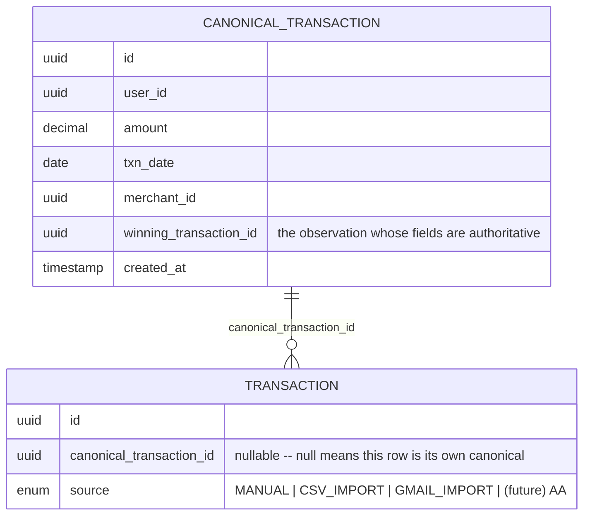

# Canonical Transaction Layer

**Status:** proposal — not scheduled, prioritized, or approved. This is a scoping doc for a
deliberately deferred feature, not an implementation spec.
**Source of truth:** current codebase, verified 2026-08-28 against `TransactionRelationship`,
`TransactionGraphService`, `GmailReconciliationMatcher`, and the V114/V115 migrations.
**Relationship to other docs:** this is the follow-up the reconciliation roadmap
(`docs/proposals/reconciliation-evolution-roadmap-proposal.md`, Part 3, "Canonical transaction
layer" subsection) explicitly named as out of scope for its own `transaction_relationships` work
and left "for its own follow-up." This doc is that follow-up — and its conclusion is: still not
now.

## Contents

1. [Problem statement](#1-problem-statement)
2. [Current state, verified against code](#2-current-state-verified-against-code)
3. [Why this is being deferred right now](#3-why-this-is-being-deferred-right-now)
4. [Illustrative schema sketch](#4-illustrative-schema-sketch)
5. [Open question: the privacy/PII trade-off](#5-open-question-the-privacypii-trade-off)
6. [Trigger conditions for revisiting](#6-trigger-conditions-for-revisiting)

---

## 1. Problem statement

A **canonical transaction** is the idea that one real-world purchase can be *observed* more than
once, by different sources, and that the system should know those observations are the same
event rather than treating them as two events.

Concrete example: on the same day, a user's Gmail inbox receives an Amazon order confirmation
("amazon.in", ₹1,240) and, two days later, their bank statement import lands a row
("AMZN MKTPLACE 4521", ₹1,240). These are not two purchases — they're one purchase, described by
two different systems in two different vocabularies, arriving through two different pipelines at
two different times.

This is a different question from the one `transaction_relationships` (Part 3 of the roadmap doc)
already answers. That graph links two **distinct** real-world events that are causally related —
a ₹20,000 credit card payment and the fourteen spend rows it settles are fourteen separate debits
that happened, linked by a `CC_PAYMENT` edge. A canonical transaction layer would instead answer
"are these **not actually two events at all**, just one event told twice" — deduplication across
sources, not linkage between events. The roadmap doc's own framing (§3, "On 'Financial Events' as
a unifying abstraction") draws this line deliberately and this doc keeps it: same mechanism
question, still two different jobs.

## 2. Current state, verified against code

### 2.1 `transaction_relationships` does not solve this

`TransactionRelationship` (`backend/src/main/java/com/finora/entity/TransactionRelationship.java`,
table from `V114__transaction_relationships.sql`) is a live many-to-many edge table between
*persisted* `Transaction` rows, with eleven relationship types in the enum
(`TRANSFER, REFUND, REVERSAL, DUPLICATE, CC_PAYMENT, EMI, SALARY, LOAN_REPAYMENT,
INVESTMENT_TRANSFER, CASH_WITHDRAWAL, CASH_DEPOSIT`). `TransactionGraphService` writes and reads
these edges; `ReconciliationService`'s four passes (duplicate, transfer, refund, reversal) dual-
write both a legacy pointer column and an edge. Detection logic exists today for only four of the
eleven types — the other seven are enum-defined with no matching service behind them yet.

Notably, `DUPLICATE` already exists as an edge type. But every current caller of it is
same-source: `ReconciliationService`'s duplicate pass compares transactions that are *already
persisted*, matching on an exact composite key (account + date + amount + description) —
`DuplicateDetector`'s job for CSV/PDF re-import. It never runs against a Gmail-vs-bank pair,
because a Gmail receipt's description ("amazon.in") and a bank line's description
("AMZN MKTPLACE 4521") are never exactly equal, and the fuzzy cross-source case is handled by an
entirely separate component (2.2 below) that today never reaches the persisted graph at all.

### 2.2 Cross-source handling today: suppression, not linkage

`GmailReconciliationMatcher`
(`backend/src/main/java/com/finora/integrations/google/merchant/GmailReconciliationMatcher.java`)
runs at **staging time**, before a Gmail receipt becomes a persisted `Transaction`. It queries
already-confirmed transactions for an exact-amount match within a ±3 day window
(`DATE_WINDOW_DAYS = 3`), then scores merchant-name similarity via Levenshtein distance against
the brand token extracted from the receipt's sender domain (threshold `0.6`, minimum brand-token
length 3). A hit is returned as a `DuplicateMatch` (`confidence = "LIKELY"`, distinct from
`DuplicateDetector`'s `"EXACT"` tier) and threaded through `GmailStagingBridge` into the staging
row shown to the user for review — `likelyDuplicate` / `duplicateMatch` fields, the same shape
CSV/PDF staging already uses.

If the user confirms the Gmail row anyway, it becomes a fully independent `Transaction` — nothing
in `findMatch`'s return path, `GmailStagingBridge`, or the confirm flow writes a
`TransactionRelationship` edge back to the bank row it matched against. **Today's model handles
"same event, two sources" by surfacing a warning at staging time and relying on the user to skip
the second observation — not by linking two persisted rows.** In the common case (the user does
skip it), the Gmail receipt's content is discarded and never persisted at all.

### 2.3 The confidence machinery this would reuse already exists

Two pieces the roadmap doc proposed for its own Phase 2 are already shipped and would be direct
inputs to any future canonicalization work, not something to build from scratch:

- `SourceTrust.of(Transaction.Source)` — static per-source trust (`CSV_IMPORT` 95,
  `GMAIL_IMPORT` 60, `MANUAL` 30; no Account Aggregator value yet, see §3 below).
- `ConfidenceScorer` — `match_confidence = base(match_type) × amount_factor × date_decay`, on a
  0–100 integer scale, already the scale `TransactionRelationship.confidence` and
  `TransactionRelationship.sourceTrust` use.

Both were built for `ReconciliationService`'s existing passes and are package-private today
(`ConfidenceScorer`, `SourceTrust` are both `final class` with no `public` modifier) — a
canonicalization effort would need to open that visibility, not reinvent the formula.

## 3. Why this is being deferred right now

### 3.1 Concurrent work already narrows the gap this doc would otherwise close

A separate, already-approved and in-progress piece of work changes §2.2's picture: Gmail matches
found by `GmailReconciliationMatcher` will start being persisted as real `TransactionRelationship`
`DUPLICATE`-type edges, `CANDIDATE` status, scored by `ConfidenceScorer`, instead of being a
staging-only warning the user is expected to act on and that then evaporates. Once that ships,
the concrete two-source example in §1 — a Gmail receipt and its matching bank row — gets an
explicit, queryable, confidence-scored link between two persisted rows. That materially covers
the case this doc's problem statement opens with.

**Where the edge-based approach genuinely suffices for two sources:** with a `DUPLICATE` edge
recorded, a caller can already ask "does this transaction have a duplicate?", see the confidence
and source-trust of the claim, and — via `TransactionGraphService.setStatus` — let a user turn a
`CANDIDATE` into a `USER_CONFIRMED` or `REJECTED` ruling that then persists. That is most of what
a "canonical transaction" concept would be asked to do in the two-source world: identify the
duplicate, let a human or a trust ranking arbitrate, remember the arbitration.

**Where it does not fully cover the problem, even after that PR ships:**

- **A `DUPLICATE` edge still connects two independent `Transaction` rows — it does not answer
  "which one is authoritative for display."** `TransactionRelationship` has no `winningTransactionId`
  concept and no field on `Transaction` that says "defer to this other row's fields." Every reader
  (dashboard totals, search, exports) still has to independently decide how to treat a
  `DUPLICATE`-linked pair — today that's `ReconciliationService`'s duplicate pass excluding one
  side from totals via a status flag, which works for the same-source case it was built for but
  was never designed as a general "pick the winner" mechanism for a cross-source pair with
  genuinely different field values (a Gmail row's merchant name vs. a bank row's, for instance).
- **A pairwise edge does not extend cleanly past two sources.** The moment a third source exists —
  Account Aggregator is the concrete one already named in the roadmap's Phase 4 — the same
  real-world event can arrive three ways: AA feed, bank statement upload, Gmail receipt. An edge
  graph can express three pairwise `DUPLICATE` edges (AA↔Gmail, AA↔Statement, Gmail↔Statement),
  but nothing about the edge table forces those three edges to agree on a single winner, and nothing
  stops a partial graph (say, only AA↔Statement got matched, Gmail sat unmatched) from leaving an
  ambiguous or contradictory picture. A `canonical_transactions` table with one `winningTransactionId`
  per real event is a genuinely different shape from N pairwise edges — it's a hub, not a mesh — and
  is the shape that scales cleanly to N sources. Building it now, for a two-source problem the
  concurrent edge work already substantially addresses, would be solving a problem this codebase
  doesn't have yet (a third source) while leaving open a problem it does have today (§5).

### 3.2 Sequencing conclusion

The roadmap doc's own Phase 4 already ties canonicalization to Account Aggregator's arrival for
exactly this reason ("now has a canonical-transaction layer and confidence engine to land into,
rather than bolting onto raw duplicate-key matching"). Nothing observed while verifying this doc
contradicts that sequencing. If anything, the concurrent Gmail-duplicate-edge work makes the
two-source case *less* urgent than the roadmap doc assumed when it was written, which strengthens
rather than weakens the case for waiting.

## 4. Illustrative schema sketch

**Non-binding — a shape to react to if and when this is picked up, not a migration to run.**
Numbering, exact column set, and defaults are all open; V-number would need re-verification
against `origin/main` at build time per this repo's own migration-collision history.

Sketch of the mechanics, following the pattern the roadmap doc's own draft used:

- Every `Transaction` starts as its own canonical — the common case (one source, one observation)
  needs no new row. `canonical_transaction_id` is only populated once a second source reports the
  same event.
- `winning_transaction_id` is chosen by `SourceTrust`, the same static ranking the duplicate pass
  already uses for its own tiebreak today — not a blended or merged row. The losing observation
  is not deleted; it stays linked for provenance and explainability (§5 is exactly why that default
  is not free).
- A `TransactionRelationship` `DUPLICATE` edge (§2.1, §3.1) and a `canonical_transactions` row are
  not mutually exclusive — an edge can be the *evidence* that causes canonicalization, and a
  canonicalization pass could plausibly consume `CANDIDATE`/`USER_CONFIRMED` `DUPLICATE` edges as
  its input signal rather than re-deriving matches independently. That reuse, if this is ever
  built, would be a deliberate design decision to work out at the time — this section only
  sketches the destination shape, not the migration path from edges to canonical rows.

## 5. Open question: the privacy/PII trade-off

**This is the crux of why this doc argues "not yet" rather than "here's the plan" — and it needs
an explicit product-owner decision before any implementation, not a default this doc picks
unilaterally.**

A canonical transaction layer, by construction, means **both** observations of the same event now
persist permanently — the winning one and the losing one. That is a real change from today's
behavior, not a paperwork formality:

- **Today:** a Gmail receipt that `GmailReconciliationMatcher` flags as a likely duplicate is
  surfaced to the user as a warning at staging time. In the common case the user skips confirming
  it, and the receipt's parsed content — item-level purchase descriptions, and sometimes
  loyalty/order numbers, which a bank ledger line never carries — is never written to the
  transactions table at all. It exists transiently during staging and then is gone.
- **With a canonical layer:** the losing observation would need to persist (to be the provenance
  record `winning_transaction_id` and the explainability layer both depend on), which means Gmail
  receipt content that today never reaches durable storage would start being retained
  indefinitely, for every future duplicate it catches — not just for the transactions the user
  actually confirms into their ledger.

The trade-off is genuine in both directions, not a case where one side is obviously right:

- **In favor of canonicalizing:** richer provenance (a user can see *why* a transaction was
  identified as the "real" one and what the second source said about it), and a cleaner
  foundation for N-way matching once Account Aggregator adds a third source (§3.1).
- **Against, or at minimum "not yet":** a real, permanent increase in how much receipt-level PII
  the ledger retains for observations that never enter the user's confirmed financial record today
  — item descriptions and order/loyalty identifiers a bank statement never contains, stored for
  transactions the user explicitly chose *not* to add.

This doc takes no position on which side wins. It is a product-owner decision, not an engineering
one, and it should be made explicitly — with a concrete answer to "what does the losing
observation's retention policy look like" — before a `canonical_transactions` implementation
starts, not discovered as a side effect partway through building it.

## 6. Trigger conditions for revisiting

Revisit this doc, rather than starting from scratch, when any of the following happens:

1. **Account Aggregator (Phase 4) work begins.** This is the concrete trigger the roadmap doc
   already names — a third source is exactly the point at which pairwise `DUPLICATE` edges stop
   being sufficient (§3.1) and a real winner-picking model earns its cost.
2. **The concurrent Gmail-duplicate-edge work ships and is observed in production for long enough
   to show its actual limits** — specifically, whether users are correctly rejecting/confirming
   `CANDIDATE` edges, or whether the lack of a "winning fields" concept (§3.1) is causing visible
   confusion (e.g. dashboard totals or search results behaving inconsistently for a linked pair).
3. **A third same-event source is proposed for any reason other than AA** (e.g. SMS parsing, a
   card-network webhook) — the N-way problem doesn't require AA specifically, only a third
   observer.
4. **The product owner makes an explicit call on §5's retention question**, independent of any
   other trigger — that decision is a precondition for implementation regardless of what else
   changes technically.

---

*A follow-up to `docs/proposals/reconciliation-evolution-roadmap-proposal.md`, Part 3. Every
schema, service, and API name above either already exists in the codebase (verified 2026-08-28) or
is explicitly marked illustrative.*
