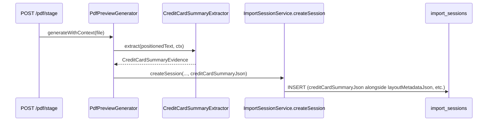
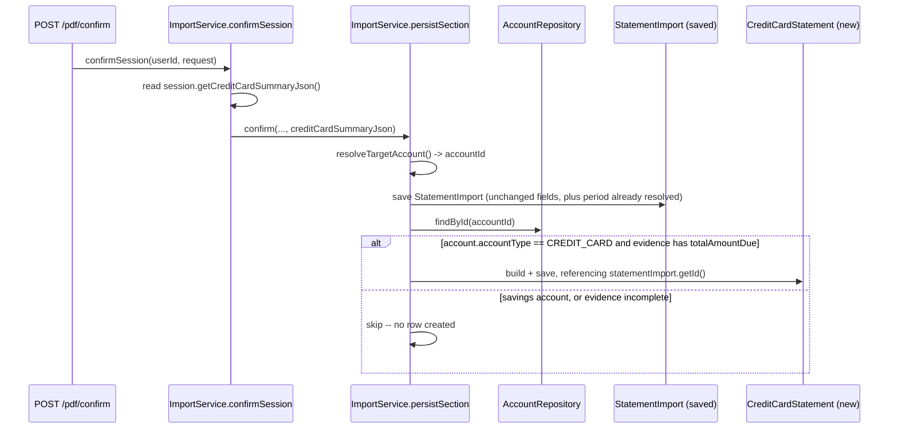

# Credit Card Statement Entity — Design for a Follow-Up PR

**Status:** design proposal — not implemented, not scheduled
**Relation to prior work:** roadmap item 6 of [reconciliation-evolution-roadmap-proposal.md](reconciliation-evolution-roadmap-proposal.md), deliberately left out of the Phase 1 implementation PR after investigation showed it needed its own design pass
**Scope:** statement creation only (visibility). Payment-matching (linking a savings-side payment to the statement it settles) stays a separate, later PR — it needs the transaction graph from Phase 2 of the roadmap, which doesn't exist yet.

## Why this needed a design pass instead of just being built

The roadmap proposal said this would "reuse fields `CreditCardFlowReconciliationValidator` already extracts." Implementing item 6 alongside the other five Phase 1 items surfaced two things that claim got wrong, both found by reading the actual code rather than assuming:

1. **`minimum_due` is not extracted anywhere in this codebase; `due_date` is.** `CreditCardSummaryExtractor.CreditCardSummaryEvidence` — the record the validator reads — carries `previousBalance`, `purchases`, `cashAdvances`, `fees`, `paymentsAndCredits`, `totalAmountDue`, and provenance fields, and nothing else; "minimum due"/"minimum amount due" text only feeds a classification signal (`hasHeaderMatch` in `PdfPreviewGenerator`, used to help detect that a section is a credit-card statement at all), never a parsed value. Building minimum-due extraction now would mean inventing new PDF-parsing capability without a real document driving it — exactly what `docs/engineering/financial-document-intelligence-principles.md`'s "evidence before capability" gate exists to prevent. Payment due date is a different story: `PdfMetadataExtractor` already extracts it, with dedicated tested logic across several real label layouts (HDFC/Axis/AU same-line, multi-line grid, ordinal-day, and plain-sentence forms — see `PdfMetadataExtractorTest`'s `paymentDueDate` cases), and it already reaches `DetectedAccountInfo.paymentDueDate`. This design was corrected mid-implementation after re-reading that code; due date belongs in scope, not deferred.
2. **The evidence doesn't survive from staging to confirm.** `CreditCardSummaryEvidence` is computed once, during `/pdf/stage`, consumed by `CreditCardFlowReconciliationValidator` to produce a `VerificationFinding` (staging-time telemetry), and then it's gone. Nothing carries it forward to the point `StatementImport` actually gets written. Creating a real, permanent `credit_card_statement` row means threading this evidence through the staging→confirm handoff — not just adding a table.

Both are addressed below rather than worked around.

## What ships in this design, and what stays out

| | In scope | Why |
|---|---|---|
| `previousBalance`, `purchases`, `cashAdvances`, `fees`, `paymentsAndCredits`, `totalAmountDue` | ✅ | Already extracted by `CreditCardSummaryExtractor`, verified against real documents |
| `period_start` / `period_end` | ✅ | Already resolved generically for every PDF import (`StatementImport.statementPeriodStart/End`), not CC-specific |
| `due_date` | ✅ | Already extracted by `PdfMetadataExtractor` (`DetectedAccountInfo.paymentDueDate`), tested against several real label layouts |
| `minimum_due` | ❌ | Not extracted anywhere today — only used as a classification signal, never parsed to a value. A future PR, gated on reading real statements that print it and building extraction the same evidence-first way every other field in this package was built |
| Payment-matching (`CC_PAYMENT` edges, `paid_status`) | ❌ | Depends on the transaction graph (roadmap Phase 2), which hasn't shipped. Adding `paid_transaction_id`/`paid_status` columns now would be speculative — unused columns for a mechanism that doesn't exist yet |

## Schema

### New table: `credit_card_statement`

```sql
CREATE TABLE credit_card_statement (
    id                   UUID PRIMARY KEY DEFAULT gen_random_uuid(),
    user_id              UUID NOT NULL REFERENCES users(id) ON DELETE CASCADE,
    account_id           UUID NOT NULL REFERENCES accounts(id) ON DELETE CASCADE,
    statement_import_id  UUID NOT NULL UNIQUE REFERENCES statement_imports(id) ON DELETE CASCADE,
    period_start         DATE,
    period_end           DATE,
    due_date             DATE,
    previous_balance     NUMERIC(14,2),
    purchases            NUMERIC(14,2),
    cash_advances        NUMERIC(14,2),
    fees                 NUMERIC(14,2),
    payments_and_credits NUMERIC(14,2),
    total_amount_due     NUMERIC(14,2),
    extraction_method    VARCHAR(20),  -- GRID | INLINE_LABEL_VALUE, from CreditCardSummaryEvidence
    created_at           TIMESTAMPTZ NOT NULL DEFAULT now()
);
CREATE INDEX idx_credit_card_statement_account ON credit_card_statement(account_id, period_start DESC);
```

Real foreign keys, unlike most of the schema added since V1 (see the prior reconciliation audit's finding that nothing past the Phase-1 core tables has DB-level referential integrity) — there's no reason to repeat that gap in a brand-new table when the parent rows (`users`, `accounts`, `statement_imports`) already exist and are known at insert time.

`statement_import_id` is `UNIQUE`: one statement, one `credit_card_statement` row. A re-import of the same statement produces a new `StatementImport` (existing dedup behavior, unchanged) and therefore a new `credit_card_statement` row — not update-in-place, matching how every other statement-derived record in this codebase treats a re-import as a new event, not a correction to the old one.

Created **only** when the confirmed account's `accountType == CREDIT_CARD` and the evidence has at least `totalAmountDue` — a savings-account PDF import, or a CC statement whose summary panel didn't extract cleanly, produces no row at all rather than a mostly-null one.

### `import_sessions.credit_card_summary_json` (new column, nullable TEXT)

The staging-time carrier. `CreditCardSummaryEvidence` (all 8 fields, Jackson-serialized) **plus** `DetectedAccountInfo.paymentDueDate` — added to the same JSON payload as a ninth field rather than a second new column, since both are staging-time CC facts that need the identical carry-forward treatment — written here at `/pdf/stage`, exactly parallel to how `layout_metadata_json`/`activated_capabilities_json`/`unparseable_summary_json` already carry their own staging-time facts forward — same mechanism, same column shape, two more fields.

No equivalent JSON column is added to `statement_imports` — the structured `credit_card_statement` table is the permanent record; keeping a second, raw copy of the same evidence there would be storing the same facts twice for no reader that needs the raw form once the structured row exists.

## Threading: staging → confirm

This reuses a path that already exists for `layoutMetadataJson` and its siblings — same shape, one more field carried alongside them at every step.





### Concrete method changes

- `ImportSessionService.createSession(...)` gains one more nullable `String creditCardSummaryJson` parameter, in the same position/spirit as `unparseableSummaryJson` — an existing overload keeps the no-arg-for-this-field call sites (Gmail staging, CSV staging, neither of which ever has CC summary evidence) compiling unchanged.
- `PdfPreviewGenerator`'s staging path serializes the `CreditCardSummaryEvidence` it already computes (line ~207, `CreditCardSummaryExtractor.extract(positioned, ctx)`) and passes it into `createSession`.
- `ImportService.confirm(...)`/`persistSection(...)` each gain one more `String creditCardSummaryJson` parameter, threaded exactly like `layoutMetadataJson` is today (see that method's own doc comment: "copied verbatim from the ImportSession this confirm came from ... never recomputed here").
- `confirmSession()`/`confirmMultiSection()` read `session.getCreditCardSummaryJson()` once and pass it down, same call shape as the existing metadata trio.
- Inside `persistSection`, after `StatementImport` is saved (its id is needed for the FK) and `accountId` is resolved: one new `AccountRepository.findById(accountId)` lookup (cheap — only reached when `creditCardSummaryJson != null`, which is only true for a PDF-format CC statement) to check `accountType`. If it's `CREDIT_CARD` and the deserialized evidence has `totalAmountDue != null`, build and save one `CreditCardStatement` row.

### New files

- `entity/CreditCardStatement.java`
- `repository/CreditCardStatementRepository.java` — `findByAccountIdOrderByPeriodStartDesc`, `findByStatementImportId`
- No new controller/API in this PR — the row (with `due_date` included) exists for Phase 3's payment-matching to consume, and for a future "your card bill" surface. Read access can wait for a caller that actually needs it, rather than shipping a speculative endpoint now.

## Migration plan

1. One migration, both schema changes together (new table + the `import_sessions` column) — they ship as one feature, and splitting them across two migrations buys nothing.
2. Numbered **V112** as of this design pass (`V111` is the latest on `main` right now). **Re-verify against `origin/main` immediately before implementing** — this repo has had three real Flyway version collisions from concurrent sessions, and two more migrations (`V110`, `V111`) landed on `main` during the Phase 1 PR's own session, which is exactly the kind of drift that makes a number picked in a design doc stale by the time it's implemented.
3. No backfill. Every existing `StatementImport` for a `CREDIT_CARD` account was confirmed before this evidence was ever threaded through — there's nothing to backfill it from, since the raw `CreditCardSummaryEvidence` was never persisted anywhere for those imports. They simply have no `credit_card_statement` row, same as any row confirmed before a feature existed.

## Risk

- **The account-type lookup adds one query to `persistSection`'s hot path.** Scoped to only fire when `creditCardSummaryJson != null` (a PDF-format CC statement, a minority of imports), so the cost is not paid on every confirm.
- **A statement whose summary panel doesn't extract cleanly** (HDFC's corrupted glyph-font issue, ICICI/SBI's table-formation bugs, all already documented in `CreditCardSummaryExtractor`'s own class comment) produces `CreditCardSummaryEvidence.NONE` or a partial evidence object — `persistSection` must check `totalAmountDue != null` before creating a row, not merely that `creditCardSummaryJson` is non-null, or a CC import from one of those banks would either throw or silently create a garbage row.
- **`extraction_method`/provenance is worth keeping** (not collapsing to just the six numbers) because `CreditCardSummaryEvidence.conflictingFields()` exists specifically to flag when the two independent extraction strategies disagreed — a `credit_card_statement` row built during a conflict is lower-confidence evidence than one built from full agreement, and a future reader (the payment-matching engine, or a person debugging a wrong-looking bill) needs to be able to tell the difference. Worth a `conflicting_fields` TEXT[] column in the actual migration, omitted from the sketch above only for brevity.

## What this unblocks

Nothing changes for users in this PR alone — no new screen, no new number surfaced. What it does: makes the `credit_card_statement` row a real, permanent, queryable fact for the first time, which is the prerequisite Phase 3's payment-matching service (roadmap Part 4) needs to exist before it can do anything. Building that service against a table that doesn't yet reliably get populated would mean building and testing it against fixtures, not real data — this PR is what makes that unnecessary.
