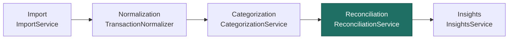
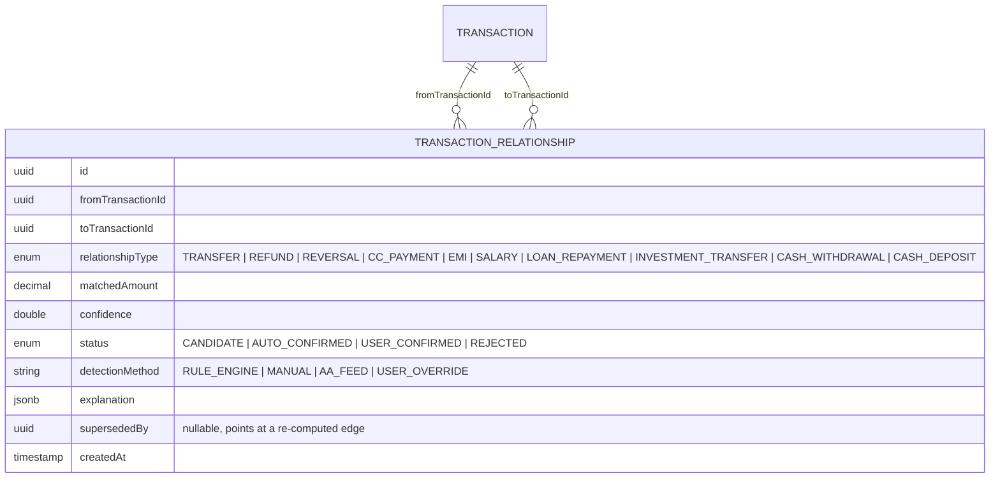
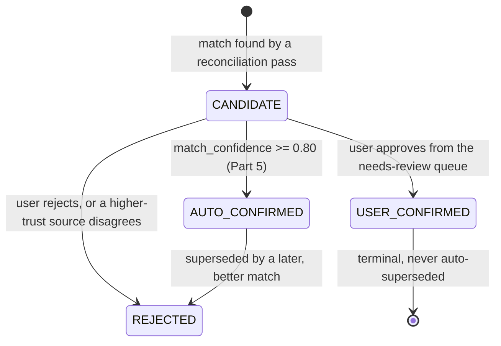
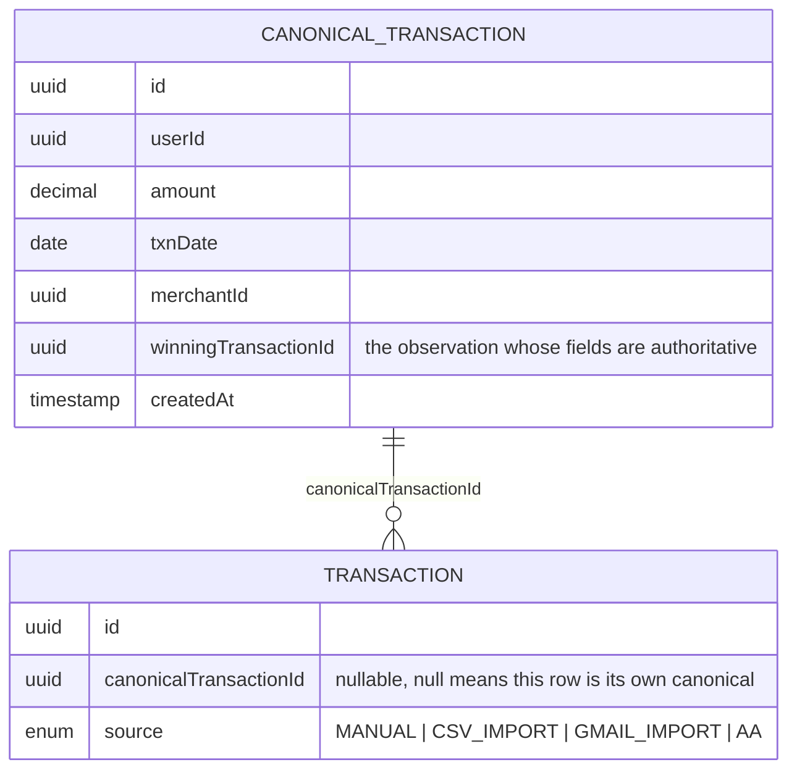
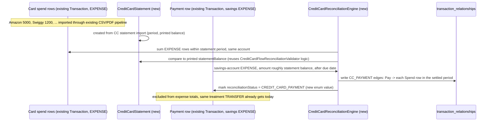
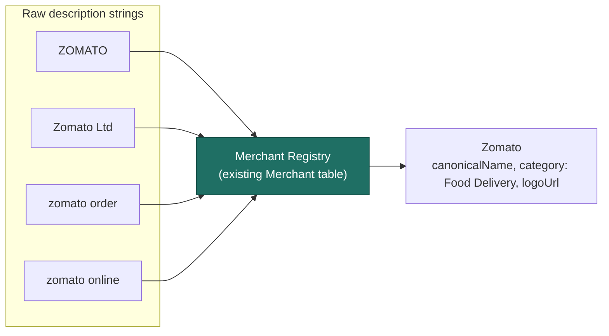

# Evolving Reconciliation into a Financial Intelligence Platform

**Status:** proposal — not scheduled, prioritized, or approved
**Source of truth:** current codebase, per the companion reconciliation audit (`docs/architecture/system-design/` — see note below on where that lives)
**Stance:** extend the existing engine (`ReconciliationService`, `ImportService`, `CategorizationService`), not a rewrite

> **How to read this document:** everything from Part 2 onward is a proposed design, not a decision. The roadmap in Part 10 is a starting draft to reorder, cut, or reject. Every phase weighting is a first estimate to argue with, not a commitment. This document also records three rounds of founder review — each revision is called out inline so the reasoning behind a change is visible, not just the final shape.

## Contents

1. [Current state, condensed](#1-current-state-condensed)
2. [Gap analysis](#2-gap-analysis)
3. [Transaction graph design](#3-transaction-graph-design)
4. [Credit card reconciliation engine](#4-credit-card-reconciliation-engine)
5. [Source confidence engine](#5-source-confidence-engine)
6. [Merchant intelligence platform](#6-merchant-intelligence-platform)
7. [Account Aggregator readiness](#7-account-aggregator-readiness)
8. [Reconciliation explainability](#8-reconciliation-explainability)
9. [Founder operations dashboard](#9-founder-operations-dashboard)
10. [Implementation roadmap](#10-implementation-roadmap)
11. [Risk & scalability assessment](#11-risk--scalability-assessment)

---

## 1. Current state, condensed



| Rule | Matching logic | Confidence model | Known edge case |
|---|---|---|---|
| Duplicate detection | Exact key: account + date + amount + description | Binary — match or no match, no score | Two genuinely separate ₹50 cash-withdrawal same-day, same-description rows collapse into one |
| Transfer detection | Different account, opposite direction, ≤₹1 apart, 4–10 day window, own-account keyword or "payment" | Binary, no score; day window is the only tunable | A coincidental ₹2,000 expense and ₹2,000 unrelated income 3 days apart, same user, can false-positive |
| Refund matching | Same account, expense precedes income ≤180 days, keyword or same merchant | Binary; tiebreak by amount-exactness then recency | A refund routed to a *different* account (common with UPI apps) is invisible to this pass — same-account is a hard requirement |
| Merchant normalization | Alias table → first-significant-token grouping → new TEMPORARY merchant | None — deterministic, no scored confidence | "Amazon Pay" and "Amazon" tokenize to the same first word by luck; "Zomato Ltd" vs "ZOMATO\*ORDER" may not |

No AI involvement anywhere in this chain today (confirmed by full-repo search) — every rule above is deterministic pattern matching.

---

## 2. Gap analysis

Fintech-grade means: every rupee accounted for exactly once, every source ranked by how much to trust it, and every account type modeled for what it actually is.

### Credit card lifecycle: can today's system model Spend → Statement → Payment?

**No — and the reason is structural, not a missing if-branch.** The current transfer pass treats a card bill payment exactly like any other cross-account transfer: same-amount, opposite-direction, within a day window. That's a coincidence match on *one* payment transaction, not a model of the underlying relationship — it has no way to say "this ₹20,000 payment settles these fourteen Amazon/Swiggy/Uber spend rows from March 3–31." The gap is that **Fynora has no concept of a billing period as an object with its own balance**, only that `StatementImport` incidentally carries `statementPeriodStart`/`statementPeriodEnd` for whichever statement happened to be uploaded.

The fix is architectural (full design in Part 4): a `credit_card_statement` record that owns a period and a printed balance, and a payment-matching service that links a savings-side payment to that statement rather than to a same-amount coincidence.

### Multi-source transaction matching

| Source | Current capability | Missing | Scaling risk |
|---|---|---|---|
| PDF/CSV statement | Full pipeline, synchronous, live | — | Low — this is the proven path |
| Credit card statement | Same pipeline + totals sanity-check | Statement-aware payment linking (above) | Low |
| Gmail | Fuzzy match against bank rows (Levenshtein, ±3 days, exact amount) | No confidence score persisted per match — only a two-tier label (EXACT/LIKELY) | Medium — template coverage is seeded-disabled for most merchants |
| Account Aggregator | none | Entire adapter layer | High if bolted on late — see Part 7 |
| Manual entry | Direct create, idempotency key only | No reconciliation pass runs against it differently from imported rows | Low |

The deeper issue: today, every source feeds the *same* reconciliation passes with no notion that a bank-verified PDF statement and a self-reported manual entry deserve different trust.

### Source priority / trust ranking — not implemented

There is no trust hierarchy anywhere in the schema or the reconciliation logic today — `Transaction.source` (`MANUAL | CSV_IMPORT | GMAIL_IMPORT`) is a provenance label, never read by any matching or scoring code. Two transactions from different sources compete as equals in every pass.

> **Proposed default ranking:** AA = 100 · Bank Statement (PDF/CSV) = 90 · Credit Card Statement = 90 · Gmail = 60 · Manual Entry = 30
> Used as a tiebreaker whenever two sources disagree about the same real-world transaction — the higher-trust source's fields win, and the loser is linked, not deleted, so the explanation trail survives.

---

## 3. Transaction graph design

The single largest structural gap. Today a transaction can point at *at most one* other transaction, through three separate single-purpose columns. A real transaction graph needs many-to-many edges with a typed relationship and its own confidence.

> **Why the current columns can't be extended:** `isDuplicateOf`, `transferPairId`, and `refundOfTransactionId` are each a single nullable UUID. A credit card payment settling 14 spend transactions, or an EMI chain of 12 monthly debits against one loan, has no home in that shape — you'd need 14 columns, not one. This isn't a missing rule, it's a missing table.

### New table: transaction_relationships



One row per edge, many edges per transaction. A CC payment settling 14 spend rows is 14 `CC_PAYMENT` edges from one `fromTransactionId`, not one column value repeated.

Existing columns (`isDuplicateOf`, `transferPairId`, `refundOfTransactionId`) stay — they're the hot-path fields the dashboard already reads, and rewriting every consumer on day one is unnecessary risk. `ReconciliationService`'s existing three passes get a fourth step: after writing the legacy column, also write the equivalent `transaction_relationships` row. New relationship types (EMI, salary, loan repayment, investment transfer, cash withdrawal/deposit) are edge-only from the start — no legacy column to shadow.

### Lifecycle state machine

A flat status was enough when every match was single-source and instant. It stops being enough the moment a canonical transaction can gain a second observation days or weeks later (Gmail sees a receipt today, the PDF statement confirms it three weeks later) — the match needs to be able to sit in an unconfirmed state without pretending to be final.



**User overrides win, permanently.** `USER_CONFIRMED` edges (`detectionMethod = USER_OVERRIDE`) are excluded from every future reconciliation re-run, the same way `notDuplicateConfirmedAt` already makes a user's "not a duplicate" call stick today — this extends an existing, proven precedent to the whole graph rather than inventing a new one. If the engine says `TRANSFER` and a user says "no, this was a real expense," that correction is permanent, not something the next nightly reconciliation pass quietly reverts.

### Decision audit trail

No new table needed — `audit_logs` (`entity_type`, `entity_id`, `action`, `metadata` JSONB, already in `V1__init_schema.sql`) is exactly this shape today, and `ReconciliationService` already writes to it: one `RECONCILIATION_RUN` row per run, summarizing counts. What it doesn't do yet is write one row per *edge* — this proposal extends that existing call site to also emit a row for every edge creation, supersession, and override: `action = "TRANSFER_MATCH_CREATED"` / `"CANONICAL_WINNER_CHANGED"` / `"USER_OVERRIDE_APPLIED"`, `entity_type = "transaction_relationship"`, `metadata` carrying the before/after state. This is a reuse, not a new subsystem.

### New service

`TransactionGraphService` — `linkTransactions(fromId, toId, type, confidence, explanation)`, `getGraph(transactionId, depth)` (BFS outward, capped depth to avoid pathological chains), `supersede(edgeId, newEdgeId)` for re-reconciliation runs, `override(edgeId, userId, newType)` writing a permanent `USER_CONFIRMED` edge and an `audit_logs` row.

### New API surface

```
GET  /api/v1/transactions/{id}/graph          -> all edges touching this transaction, both directions
GET  /api/v1/transactions/{id}/graph?depth=2  -> walk EMI chains / multi-hop transfers
POST /api/v1/transactions/{id}/relationships  -> manual link (user corrects a miss), scope: user's own transactions only
```

### Migration plan

1. **V107** — create `transaction_relationships`, indexed on `(fromTransactionId)`, `(toTransactionId)`, `(relationshipType)`.
2. **Backfill** — one-time job walks existing `Transaction` rows and materializes an edge for every populated `isDuplicateOf`/`transferPairId`/`refundOfTransactionId`, tagged `detectionMethod=RULE_ENGINE`, confidence 1.0 (they were binary matches). Idempotent — safe to re-run.
3. **Dual-write** — `ReconciliationService` writes both the legacy column and the new edge for the three existing relationship types.
4. **New types ship edge-only** — EMI/salary/loan/investment/cash movement never get a legacy column.
5. Re-verify the migration number against `origin/main` immediately before merging — this repo has had three real Flyway version collisions from concurrent sessions; `V107` is correct only as of the check run for this document.

### Canonical transaction layer

The graph above links *confirmed* transactions to each other. It doesn't yet solve a different problem the AA integration (Part 7) will force immediately: the same real-world purchase reported by more than one source. Today's duplicate detector only catches this when the description strings coincide almost exactly — it has no model for "these three rows are three *observations* of one real event," which is a different relationship than "these are the same row twice."



Every transaction starts as its own canonical (the common case — one source, one observation, nothing to reconcile against). When a second source reports the same real-world event, both rows point at one `CanonicalTransaction`, and `winningTransactionId` — chosen by `source_trust` from Part 5, not blended into a merged row — decides which observation's fields (merchant, category, memo) the UI and reports actually show. The losing observation isn't deleted; it stays as provenance, visible in the explainability layer. This is the piece that makes "one financial truth from multiple sources" concrete rather than aspirational, and it's a prerequisite for Part 7, not an optional add-on once AA lands.

> **On "Financial Events" as a unifying abstraction:** as a way to *talk about* the system, yes — an Amazon purchase, a salary credit, a CC bill payment are all "financial events" in plain English. But as a single new data structure, it would quietly merge two mechanisms that solve different problems on purpose: `CanonicalTransaction` answers "is this the *same* real-world event, reported twice?" (deduplication); `transaction_relationships` answers "are these two *different* real-world events *causally linked*?" (a CC payment and the spend it settles are two distinct debits/credits, not one event observed twice). Collapsing them into one "Financial Event" table would force every consumer to disambiguate observation-of from linked-to on every read. Keeping them separate costs nothing extra — a canonical transaction can still have graph edges to other canonical transactions — and keeps each mechanism doing one job.

---

## 4. Credit card reconciliation engine

The concrete goal: a ₹5,000 Amazon charge followed by a ₹20,000 statement payment must net to **₹20,000 of real spend**, never ₹40,000.



### Database design

```sql
-- credit_card_statement (new table, V108)
id                  uuid
account_id          uuid        -- the CREDIT_CARD account
statement_import_id uuid        -- links to the StatementImport row that produced this
period_start        date
period_end          date
statement_balance   decimal     -- printed total due
minimum_due         decimal
due_date            date
paid_transaction_id uuid nullable  -- the savings-side payment, once matched
paid_status         enum "UNPAID | PARTIALLY_PAID | PAID | OVERPAID"
```

### Reconciliation rules

- **Statement creation:** when a CC statement is imported, a `credit_card_statement` row is created from the balance fields (`previousBalance`, `purchases`, `cashAdvances`, `fees`, `paymentsAndCredits`, `totalAmountDue`) `CreditCardSummaryExtractor` already extracts today, plus the period `StatementImport` already resolves and `due_date`, which `PdfMetadataExtractor` already extracts (tested against several real label layouts). Only `minimum_due` is genuinely unextracted — it's used solely as a classification signal today, never parsed to a value — and stays out of scope until a future extraction PR builds that the same evidence-first way every other field here was built. This also isn't purely additive: the extracted evidence is discarded after staging today, so shipping this means threading it through to confirm time, not just adding a table — see [credit-card-statement-entity-design.md](credit-card-statement-entity-design.md) for the full design.
- **Payment candidate search:** a savings-account EXPENSE within ±7 days of `due_date`, amount within ₹1–₹50 of `statement_balance` (small variance for late-fee/rounding), to a payee matching the card's issuer (reuse `RelationshipService` own-account identifiers, extended to bank-issuer name matching).
- **Settlement:** once matched, every EXPENSE row inside `[period_start, period_end]` on the card account gets a `CC_PAYMENT` edge from the payment transaction. `paid_status` updates from the matched amount vs. `statement_balance`.
- **Net-worth/cash-flow reads:** a payment transaction with `reconciliationStatus = CREDIT_CARD_PAYMENT` is excluded from expense totals the same way a `TRANSFER` already is — this is a one-line addition to whatever filter currently excludes `TRANSFER`/`DUPLICATE`, not a new reporting engine.

### Edge cases

- **Partial payment** (minimum due only): `paid_status = PARTIALLY_PAID`; only a pro-rated share of spend rows should net out — the rest still counts as real spend until a later payment closes the gap. Ratio-based edge weighting handles this without new columns.
- **Overpayment** (paying more than the statement, e.g. clearing an old balance too): flag `OVERPAID`, don't force a 1:1 match — surface it to the explainability layer rather than silently absorbing it.
- **No CC statement was ever imported** (spend-only tracking): the payment falls back to today's generic transfer pass — degrades gracefully rather than breaking.
- **Two cards, same issuer, same due date, same amount by coincidence:** issuer-name + last-4-digit matching (already partially available via `Account.accountNumberMasked`) disambiguates before falling back to amount-only.

---

## 5. Source confidence engine

Every match today is binary — matched or not. A production-grade engine scores *how sure* it is, and that score is what the explainability layer and the founder dashboard actually display.

> **Revised after review:** the first draft blended source trust and match quality into one number. That's wrong — a perfect PDF match (low-trust source, high-quality match) and a sloppy AA match (high-trust source, weak match) shouldn't be able to land on the same score and look identical. The two stay separate outputs; nothing downstream is allowed to collapse them back into one.

> **On "just ship `{confidence, reason}`" — the simplification is right, collapsing the two fields isn't.** Full agreement that `amount_factor` / `date_decay` multipliers are not a Phase 1 concern — nobody should wait on that formula to ship. But the fix is to simplify *what feeds `match_confidence`* (Phase 1: just the match-type base score below, plus a plain-English `reason` string), not to re-merge it with `source_trust` into one number. Phase 1 ships `{ source_trust, match_confidence, reason }` — three simple fields, no formula. The formula is what Phase 2 adds on top, not a precondition for shipping.

### Per-transaction confidence object (new, attached to every Transaction and every graph edge)

```json
{
  "source_trust": 60,
  "match_confidence": 0.91,
  "source": "GMAIL",
  "match_type": "MERCHANT_AND_AMOUNT",
  "components": {
    "amount_exact": true,
    "date_within_window": true,
    "merchant_similarity": 0.83
  },
  "needs_review": false
}
```

### Two independent scores, not one blend

| Field | What it answers | Computed from |
|---|---|---|
| `source_trust` | "How much do we trust *this channel* in general?" | Static, per-source — the Part 2 ranking (AA 100 · Statement 90 · Gmail 60 · Manual 30) |
| `match_confidence` | "How sure are we *this specific pairing* is correct?" | Per-match — match type, amount closeness, date proximity |

A downstream consumer decides how to combine them for its own purpose — auto-confirm might require both above a floor; a tiebreak between two conflicting sources for the same real-world transaction (Part 3's canonical layer) might weight `source_trust` more heavily than `match_confidence`. The engine never pre-decides that tradeoff by fusing them into one number.

### Match-type base scores (feeds `match_confidence` only)

| Match type | Score |
|---|---|
| Exact match | 0.99 |
| Merchant + amount match | 0.90 |
| Fuzzy match (Levenshtein ≥ 0.6) | 0.75 |

> **Removed after review:** a reserved "AI-assisted match" tier stood here in the first draft. Reconciliation — duplicate, transfer, refund, CC settlement, AA matching — is a deterministic problem end to end, and every tier above already outperforms what an AI match would score. AI has a legitimate future role in this codebase (merchant enrichment, insight generation, anomaly explanations), but not inside the matching engine — see Part 10.

```
match_confidence = base(match_type) x amount_factor x date_decay
```

- `amount_factor` = 1.0 if exact, else `1 − (|delta amount| / matched_amount)`, floored at 0.5.
- `date_decay` = 1.0 at day 0 of the match window, linearly decaying to 0.7 at the window's edge (so a same-day refund outranks a 179-day-old one under the existing 180-day refund window).
- `source_trust` is deliberately absent from this formula — it travels alongside `match_confidence`, never multiplied into it.

Reuses inputs the engine already computes today — `ReconciliationPolicy`'s tolerance/window constants, `GmailReconciliationMatcher`'s Levenshtein score — it packages them into two numbers instead of discarding them after a binary decision.

### Needs-review queue

Any match with `match_confidence < 0.80` gets `needs_review = true` instead of being silently auto-applied — this reuses the exact pattern `Transaction.needsCategoryReview` already established for categorization, extended to reconciliation matches. Surfaced as a filtered queue in the Founder Operations Dashboard and, longer-term, a user-facing "confirm this match" prompt. Every reviewed decision — confirm or reject — is logged with its original `match_confidence`, which is exactly the labeled dataset a future higher-precision matcher (rule-tuning or, eventually, AI-assisted) would need to train against.

---

## 6. Merchant intelligence platform

`MerchantNormalizationEngine` and `Merchant`/`MerchantAlias` already exist and do the right first-pass job. This is an upgrade to that engine, not a replacement.



| Component | Status | Change |
|---|---|---|
| Merchant registry | reused | `Merchant` table as-is |
| Merchant aliases | reused | `MerchantAlias` as-is; seed a curated alias set for the top-50 Indian merchants (Swiggy, Blinkit, Zepto, Netflix, Amazon, Google, Apple, Uber, ...) instead of relying only on organic first-token learning |
| Merchant categories | partial today | Add a `defaultCategoryId` on `Merchant` so a brand-new user's first Swiggy transaction is pre-categorized "Food Delivery" without waiting for the learned-mapping table to warm up |
| Merchant confidence scoring | new | Reuses the Part 5 formula — an alias-table hit scores 0.99, a first-token grouping guess scores lower and stays `lifecycleStatus=TEMPORARY` until enough transactions confirm it |

The existing code's own comment already flags this weakness accurately: first-token grouping is "not fuzzy matching or NLP." The fix that matches this codebase's own philosophy is a bigger curated alias/template seed (the pattern already used for Gmail's `MerchantTemplate` table), not introducing an ML model.

---

## 7. Account Aggregator readiness

Can today's reconciliation architecture take an AA feed? **Structurally, yes — it's the best-fitting new source the architecture has, because AA data arrives already normalized (unlike a scanned PDF).** But it needs an adapter, and it needs the source-trust ranking from Part 2 to actually mean something.

```mermaid
flowchart LR
    aa["Finvu / AA Provider<br/>(Open Banking, FIU-side)"] --> adapter["AA Adapter Layer (new)<br/>consent, decrypt, poll/webhook"]
    adapter --> norm["Normalizer<br/>maps AA schema to existing StagedRow shape"]
    norm --> stage["ImportSession<br/>source = AA (extends existing GMAIL pattern)"]
    stage --> confirm["ImportService.confirmSession()<br/>unchanged"]
    confirm --> rec["ReconciliationService<br/>unchanged, now source-trust-aware"]
    rec --> insights["Insights"]
    style adapter fill:#6a4f9e,stroke:#3f2e63,color:#fff
    style norm fill:#6a4f9e,stroke:#3f2e63,color:#fff
```



### Why this fits without a rewrite

Gmail already proved the pattern: a new source becomes a new `ImportSession.source` value plus a bridge service that produces staged rows, then rejoins the exact same `confirmSession`/reconciliation path everything else uses. AA slots into that seam directly — `AaStagingBridge` mirrors `GmailStagingBridge`'s shape.

### Migration strategy

1. **Adapter first, no reconciliation changes.** Build consent flow + AA client + normalizer; land AA transactions as staged rows a user reviews manually, same as Gmail does today. Zero risk to the existing engine.
2. **Wire source-trust ranking into the duplicate pass.** Today, if the same real transaction arrives via both a manually uploaded PDF and an AA feed, the duplicate detector's exact-key match will still catch it (same account/date/amount/description) — but once descriptions diverge slightly between AA's format and a bank's PDF format, it won't. This is the one place existing logic needs a real change: extend `duplicateKey()` matching to consider source-trust when descriptions are close-but-not-identical, promoting the AA-sourced row as canonical.
3. **Auto-confirm for high-trust sources, once proven.** Only after the adapter has run in shadow/manual-review mode long enough to trust it — AA rows skip the staging review screen and confirm automatically, the way none of today's sources do.

---

## 8. Reconciliation explainability

The raw material already exists — `ReconciliationExplanation` writes a JSON blob today. This is about exposing it, not computing anything new.

### API design

```
GET /api/v1/transactions/{id}/explanation

{
  "transactionId": "a1f3...",
  "categorization": {
    "decisionSource": "USER_RULE",
    "ruleId": "r-882",
    "reason": "Description contains 'SWIGGY' -> user rule #882 assigns category 'Food Delivery'"
  },
  "reconciliation": {
    "status": "REFUND",
    "matchedTransactionId": "b7e2...",
    "reason": "Matched expense b7e2... (Rs 340, 2026-08-09) - same merchant 'Zomato', within 180-day window",
    "confidence": 0.91
  },
  "graph": [
    { "type": "REFUND", "to": "b7e2...", "confidence": 0.91 }
  ]
}
```

### UI suggestion

An expandable "Why?" affordance on any transaction row — not a separate screen. Tapping it surfaces exactly three questions: why this category, why this match, why this status. Render the matched transaction inline (not just its ID) so a user can immediately see and dispute a wrong link.

| Transaction row | -> | "Why?" expansion |
|---|---|---|
| Zomato refund, + ₹340 · Aug 11, status REFUND · 91% | | matched to: Zomato order, Aug 9, ₹340 · reason: same merchant + refund keyword · action: [This is wrong →] |

---

## 9. Founder operations dashboard

Internal-only tools, admin portal. `AdminReconciliationStatsService` already exists as read-only counts — these three explorers are the drill-down layer on top of it.

**Reconciliation Explorer** — Raw → Normalized → Matched → Confidence → Final classification, for any transaction:
`"REFUND ZOMATO 340.00"` → `merchant: Zomato, category: Dining` → `edge: REFUND → b7e2...` → `0.91` → `status: REFUND`

**Import Explorer** — Uploaded statement → parsed rows → stored transactions, side by side, for any `StatementImport` or `ImportJob` id — surfaces exactly where a row was dropped, miscategorized, or failed validation, using data `ImportVerificationRecorder` and `import_job_stages` already capture but don't currently expose to a UI.

**Insight Explorer** — Every number on the user-facing dashboard, traced back to the transaction set and formula that produced it — since `InsightsService` computes everything on the fly with no persistence, this explorer's job is to re-run that computation in a debug mode that logs its inputs instead of just returning the final number.

---

## 10. Implementation roadmap

Draft sequencing — reorder freely. Weights are relative effort within the phase, not calendar commitments.

> **Resequenced after review (round 1):** the first draft built the credit-card lifecycle engine in the same phase as the transaction graph it depends on. Splitting them — prove the graph and confidence engine on the relationship types that already exist today (transfer, refund, duplicate) before trusting them for money-bearing CC settlement logic — is the lower-risk order.
>
> **Resequenced again (round 2):** two items moved into Phase 1 because they don't actually need the graph or the full confidence engine to ship — a *bare* `credit_card_statement` entity (statement created at import time, no payment matching yet) is independent of Part 3 and delivers visible value on its own, and a static source-trust ranking is three constants and a tiebreak comparison, not a reason to wait for Part 5's full formula.

### Phase 1 — Quick wins (3–5 weeks, no graph, no formula)

| Item | Description | Weight |
|---|---|---|
| ✅ Credit card statement entity — **shipped** (PR [#451](https://github.com/siddharth705/finora/pull/451), [#453](https://github.com/siddharth705/finora/pull/453)) | Landed smaller than designed: no new `credit_card_statement` table was needed — the fields (period, previous balance, purchases, cash advances, fees, payments/credits, total due, due date) live directly on the existing `statement_imports` table, populated at confirm time via a staging→confirm contract change threading `CreditCardSummaryEvidence` through `ImportSession`/`ImportService`. **Not** minimum due, which nothing extracts today. Visible to the user immediately. Payment-matching stays in Phase 3, since that part genuinely needs the graph. | 20% |
| Explainability API | Expose the JSON that `ReconciliationExplanation` already writes — no new computation. | 20% |
| ✅ Static source trust ranking — **shipped** | `SourceTrust.of(Transaction.Source)`, used only as a tiebreak inside the existing duplicate pass. Actual values differ from this doc's original guess: `CSV_IMPORT` 95 · `GMAIL_IMPORT` 60 · `MANUAL` 30 — no AA value yet, since `Transaction.Source` has no AA case until Phase 4's adapter lands. Not the full `match_confidence` formula — that's Phase 2. | 15% |
| Curated merchant alias seed | Top-50 merchant aliases + default categories, same pattern as existing `MerchantTemplate` seeds. | 20% |
| Refund netting reaches BudgetService | One-line integration of already-computed `RefundNetting` into the budget read path. | 10% |
| ✅ Reversal split from refund — **shipped** | New enum value `REVERSAL`, split off the shared "reversal" keyword that used to fold into `REFUND_KEYWORDS` — the refund pass now branches on a dedicated `REVERSAL_KEYWORDS` set (`"reversal"`, `"payment reversed"`) and writes a distinct `ReconciliationExplanation.reversal(...)`. | 15% |

### Phase 2 — Transaction graph & confidence engine (1–2 months, foundation, not a user-facing feature)

| Item | Description | Weight |
|---|---|---|
| 🔶 transaction_relationships table — **in progress** (PR [#460](https://github.com/siddharth705/finora/pull/460)), canonical transaction layer **not started** | Ships with all ten relationship types *defined* in the enum (free — it's a schema value), but real detection logic is built for only four: `TRANSFER`, `REFUND`, `REVERSAL`, `DUPLICATE` — the ones that already exist today and just need an edge alongside their legacy column. PR #460 does exactly this: `transaction_relationships` table, `TransactionGraphService`, dual-write from `ReconciliationService`'s four passes, and a backfill for existing legacy-column pointers. The canonical transaction layer (`canonical_transactions`, a separate table for cross-source dedup) is a materially different, riskier concern this doc itself says shouldn't be merged into this table — left for its own follow-up. `CC_PAYMENT` follows in Phase 3; `EMI`/`SALARY`/`LOAN_REPAYMENT`/`INVESTMENT_TRANSFER`/`CASH_WITHDRAWAL`/`CASH_DEPOSIT` stay enum-only, no matching service, until Phase 4 gives a reason to build one. | 35% |
| Confidence scoring engine | Upgrades Phase 1's static `source_trust` constant and simple match-type `reason` string into the full formula — `amount_factor` / `date_decay` — across all three existing passes plus Gmail matching, plus the needs-review queue. `source_trust` and `match_confidence` stay two fields throughout, never collapsed into one. | 30% |
| Founder operations dashboard | Reconciliation/Import/Insight explorers on the admin portal — the tool for verifying the graph and confidence engine are behaving before anything downstream trusts them. | 35% |

### Phase 3 — Credit card settlement (3–4 weeks, depends on Phase 2)

| Item | Description | Weight |
|---|---|---|
| Payment-matching service | Links a savings-side payment to the Phase 1 `credit_card_statement` row via `CC_PAYMENT` edges on the now-proven graph — statement-period settlement, partial/overpayment handling. Smaller scope than the original draft since the entity itself already shipped in Phase 1. | 55% |
| Net worth & cash flow, graph-aware | Reporting layer that reads the transaction graph instead of raw transaction sums — this is where the CC-lifecycle fix actually pays off in a number the user sees. Scoped to reporting on top of existing transactions; a full assets/liabilities/investments ledger is a separate initiative (see below). | 45% |

### Phase 4 — Account Aggregator, only once reconciliation is trustworthy (quarter+)

| Item | Description | Weight |
|---|---|---|
| AA adapter layer | Consent flow, normalizer, staged-review integration — now has a canonical-transaction layer and confidence engine to land into, rather than bolting onto raw duplicate-key matching. | 45% |
| EMI / salary / loan / investment / cash-movement detection | Real matching logic for the six relationship types that shipped enum-only in Phase 2 — built once actual usage data (not a guess) shows which of the six users actually need first. | 55% |

> **Removed after review: AI-assisted matching.** The first draft reserved a Phase 4 slot for it. Every problem this roadmap solves — duplicate detection, transfers, refunds, CC settlement, AA matching, canonicalization — is deterministic, and belongs to the class of problems that should stay deterministic: a wrong reconciliation is a wrong financial number, not a wrong recommendation. AI's legitimate place in this codebase, if and when it's built, is **merchant enrichment, insight generation, and anomaly explanations** — none of which decide what a transaction *is*, only how it's described or surfaced. That's a separate track from this roadmap entirely, not a later phase of it.

> **Deliberately out of scope for this roadmap:** a full **net worth ledger** (assets, liabilities, investments, loans as first-class tracked balances, not just transactions), **household/shared finance** (splitting an expense with a partner, employer reimbursement), and a **canonical account layer** (the same "one real thing, many observations" problem the canonical transaction layer solves, applied to accounts once AA and multiple statement sources can all describe the same HDFC savings account) are all real, valuable directions — but each is an adjacent problem to reconciliation, not reconciliation itself. Worth dedicated proposals once this roadmap's foundation (Phases 1–2) has shipped.

---

## 11. Risk & scalability assessment

**Risk**
- Dual-writing legacy columns + new edges (Part 3) doubles the write surface during migration — a bug there corrupts both representations at once. Mitigate with the backfill's idempotent re-run design.
- Statement-aware CC matching (Part 4) is a new source of false links if issuer-name matching is too loose — must default to *surface, don't auto-net* until confidence exceeds a high bar.
- AA integration (Part 7) is the first external, real-time, credential-bearing dependency in this codebase — different operational risk class than parsing an uploaded file.

**Scalability**
- `ReconciliationService`'s passes are already documented as in-memory, per-user list operations — fine at today's scale, but the graph table's `getGraph(id, depth)` BFS needs a hard depth cap from day one or a pathological EMI/transfer chain becomes a slow query at 100k users.
- No DB-level FKs anywhere outside Phase-1 tables (per the companion audit) — the new `transaction_relationships` table should not repeat that pattern; add real foreign keys and indexes on both directions from the start.

**What stays untouched**
- The synchronous CSV/PDF confirm path — proven, live, no reason to touch it.
- `CategorizationService`'s precedence order — none of this roadmap changes how a category gets assigned.
- The decision to stay rule-based rather than adopt an LLM for core matching — every tier in Part 5's scoring table shows rule-based methods already scoring higher than the reserved AI tier.

---

*A companion document to the Fynora Reconciliation Audit. Every schema, service, and API name above either already exists in the codebase or is proposed to sit directly beside an existing equivalent — nothing here assumes a rewrite.*
