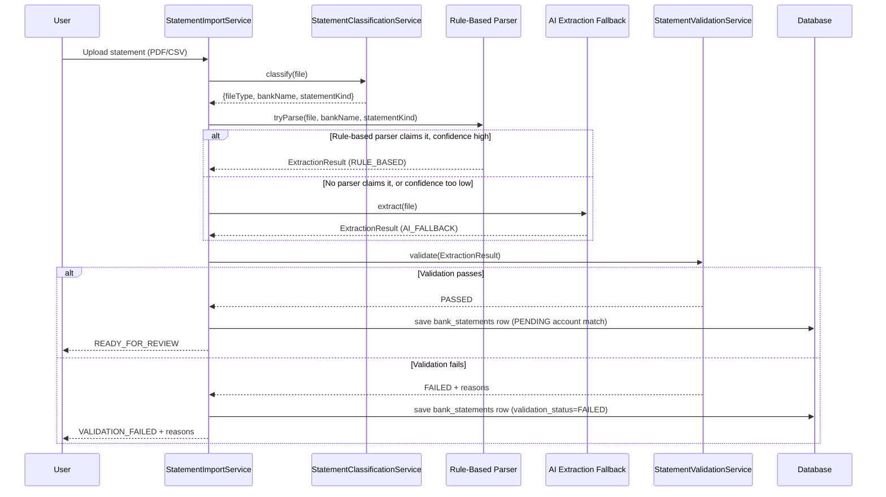
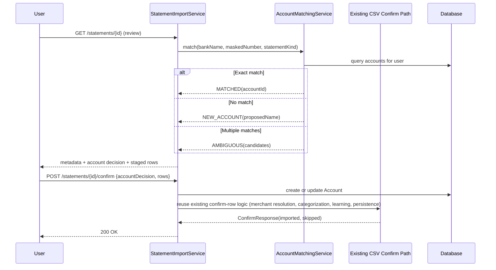

# Finora Statement Intelligence Engine — Technical Specification

**Status:** Design review draft. Nothing in this document is built yet — no implementation should proceed against it until it's reviewed and approved, and until the specific legal/compliance checkpoint in §10.2 has been addressed.
**Scope:** Statement ingestion (PDF + CSV), bank/account-type detection, hybrid extraction, validation, and account matching/creation — the pipeline that turns an uploaded statement into a fully populated, correct account and transaction set with no manual data entry.

---

## 0. Relationship to Existing Systems (read this first)

This is a companion document to `financial-intelligence-engine-spec.md`, not a replacement or a re-spec of it. To keep scope honest:

- **This document owns:** getting a statement (PDF or CSV) from "just uploaded" to "a validated set of `(date, description, amount, type)` rows plus statement/account metadata, ready to enter the existing pipeline." Everything about *what happens to a transaction once it has that shape* — merchant resolution, categorization, confidence, learning, duplicate/transfer detection — is already specified and, in part, already built. This document does not redesign any of it.
- **This document explicitly defers, to their own future specs:**
  - The AI-powered financial insight engine and redesigned dashboard (net worth tracking, spending forecasts, personalized recommendations) — a real feature, but a read/analytics-layer concern, not a statement-ingestion concern. Bundling it into this document would repeat the mistake this project has already corrected for once (see the Financial Intelligence Engine spec's own §8 principle 6: defer complexity until a real need justifies it).
  - Gmail integration — explicitly named in the product vision as a later phase. Nothing in the CASA-review argument raised earlier in this project's history has changed; that stays a separate, later decision.
  - EMI detection, UPI recognition, subscription identification, salary recognition, and refund classification — these are **categorization/recurring-detection refinements**, not statement-processing concerns. They hook into `CategorizationService` and `RecurringService` (already specified) once transactions exist. This document notes where the hooks are (§4, step 7) but does not re-architect those services here.
- **Currently implemented, for real, today:** nothing. `CsvImportService` explicitly documents PDF as out of scope in its class-level comment ("bank PDF layouts vary too much for a generic parser to handle reliably without per-bank templates"). This document is the design that changes that — but it changes it deliberately, not by quietly overriding a decision that was made for a real reason.

| Component | Status |
|---|---|
| CSV statement import (manual account selection, no auto-create) | ✅ Implemented (`CsvImportService`) |
| Bank/statement-type detection | 🔲 Spec only |
| Rule-based PDF parsers (per bank) | 🔲 Spec only |
| AI-fallback extraction | 🔲 Spec only — also gated on §10.2 |
| Validation framework (arithmetic/period/duplicate checks) | 🔲 Spec only |
| Account matching / auto-create / auto-update | 🔲 Spec only |
| Credit-card-specific fields on `Account` | 🔲 Spec only (schema gap — see §3.2) |
| Statement Review UI | 🔲 Spec only |

---

## 1. Overall Architecture

```
Uploaded Statement (PDF or CSV)
        │
        ▼
Ingestion & Classification     — file type, issuing bank, account type (savings/current/credit card)
        │
        ▼
Extraction (hybrid)
   ├─ Rule-based parser (primary, if bank is supported)
   └─ AI extraction fallback (if unsupported, or rule-based confidence too low)
        │
        ▼
Validation Framework           — arithmetic, period, duplicate, and metadata integrity checks
        │
        ▼
Account Matching               — existing account (update) vs. new account (create) — see §4.4
        │
        ▼
Staged Review                  — user reviews extracted metadata + transactions before commit (§6)
        │
        ▼
Existing Financial Intelligence Pipeline (unchanged — see companion spec)
   merchant resolution → categorization → confidence → learning → persistence
        │
        ▼
Dashboard Refresh
```

The extraction stage is the only genuinely new kind of processing here. Everything from "Staged Review" onward is intentionally the *same* pipeline CSV import already uses — a statement-derived transaction and a CSV-derived transaction should be indistinguishable to the categorization engine by the time either reaches it.

---

## 2. Component Responsibilities

| Component | Responsibility | Explicitly NOT responsible for |
|---|---|---|
| **Statement Classifier** (`StatementClassificationService`) | Given a raw file, determine file type, issuing bank (best-effort), and statement kind (savings / current / credit card) | Extracting field values — classification only decides which parser/prompt to route to |
| **Rule-Based Parser Registry** (`StatementParser` interface + one implementation per supported bank) | Deterministic field + transaction extraction for a specific bank's known layout | Anything outside its own bank's format. A parser that can't confidently match the document it's given must decline (return "not my format"), never guess |
| **AI Extraction Fallback** (`AiStatementExtractionService`) | Structured extraction for statements no rule-based parser claims, or where rule-based confidence is below threshold | Being the default path. Only invoked when the rule-based path opts out — see §8, principle 1 |
| **Validation Framework** (`StatementValidationService`) | Arithmetic reconciliation, period/date sanity, transaction-sum-matches-totals checks, regardless of which extraction path produced the data | Extraction itself, or deciding auto-apply vs. review (that's downstream, same as the existing Confidence Engine pattern) |
| **Account Matching Service** (`AccountMatchingService`) | Given extracted bank + masked account number + account type, decide: matches existing account / ambiguous / new account | Creating the account without a clear signal — ambiguous matches are surfaced to the user, never guessed (§4.4) |
| **Statement Import Orchestrator** (`StatementImportService`) | Coordinates the above stages for one uploaded file end-to-end, and hands the result to the existing CSV-import-shaped staging/confirm flow | Merchant resolution, categorization, or anything already owned by the Financial Intelligence Engine |

---

## 3. Database Design

### 3.1 New table: `bank_statements`

One row per uploaded statement — the extracted metadata, plus an audit trail of how it was processed.

| Column | Purpose |
|---|---|
| `id`, `user_id` | Standard |
| `account_id` | Nullable until Account Matching resolves it; set once matched or newly created |
| `file_type` | `PDF` \| `CSV` |
| `bank_name` | Detected issuing bank, nullable if classification couldn't determine it |
| `statement_kind` | `SAVINGS` \| `CURRENT` \| `CREDIT_CARD` |
| `extraction_method` | `RULE_BASED` \| `AI_FALLBACK` — which path actually produced this result |
| `extraction_confidence` | 0–100, meaning differs by path: rule-based is close to binary (matched cleanly or declined), AI-fallback confidence reflects the model's own reported certainty, taken as a signal, not a guarantee — see §8 principle 3 |
| `account_holder_name`, `masked_account_number` | Extracted identity fields |
| `statement_period_start`, `statement_period_end`, `statement_date` | Extracted period fields |
| `opening_balance`, `closing_balance`, `available_balance` | Savings/current fields (nullable for credit card statements) |
| `credit_limit`, `outstanding_balance`, `minimum_amount_due`, `payment_due_date`, `reward_points` | Credit-card fields (nullable for savings/current statements) |
| `validation_status` | `PENDING` \| `PASSED` \| `FAILED` |
| `validation_notes` | Human-readable reasons if `FAILED` or if passed with warnings |
| `created_at` | Standard |

**Deliberately not a column here:** the raw uploaded file itself. See §10.3 for why — retention of the source PDF/CSV after extraction is a privacy decision, not a schema one, and defaults to *not* keeping it.

### 3.2 Extending `Account`

The current `Account` entity (see companion spec's implementation, already in the codebase) has `name`, `accountType`, `balance`, `creditLimit`, `dueDate`, `investmentKind` — enough for manual account creation, not enough to represent what a statement actually contains. New nullable columns:

| Column | Reused or new | Notes |
|---|---|---|
| `bank_name` | New | |
| `masked_account_number` | New | The account-matching key component (§4.4) |
| `account_holder_name` | New | |
| `available_balance` | New | Distinct from `balance` — a savings account's available balance can differ from ledger balance (holds, etc.) |
| `outstanding_balance` | New | Credit card only |
| `minimum_amount_due` | New | Credit card only |
| `reward_points` | New | Credit card only |
| `due_date` | **Reused, not duplicated** | `Account.dueDate` already exists and already means "payment due date" for credit cards — statement extraction populates this existing column rather than adding a second one. Same discipline as the companion spec's `processingSource`/`Transaction.source` reconciliation (§9.2 there) |
| `last_statement_id` | New | FK to `bank_statements`, nullable — "what's the most recent statement we've processed for this account" |

`creditLimit` already exists and is reused as-is.

### 3.3 Extending `Transaction`

- `source` enum gains one new value: `STATEMENT_IMPORT`. Not split into `STATEMENT_PDF`/`STATEMENT_CSV` — the categorization pipeline has no reason to treat those differently, and CSV-uploaded-as-a-statement vs. CSV-uploaded-via-the-existing-import-flow are already two different code paths distinguishable by `bank_statement_id` below if it's ever actually needed. Don't split an enum for a distinction nothing reads yet (companion spec §8, principle 6).
- `bank_statement_id` — new nullable FK to `bank_statements`. Existing `CSV_IMPORT`-sourced and manually-entered transactions leave this null; only rows produced by this pipeline set it. This is what makes "which statement did this transaction come from" and "have we already imported this statement" answerable.

### 3.4 Migration numbering

This is additive schema work — new nullable columns and one new table, no changes to existing column semantics. Follows the existing `V{n}__description.sql` convention (next available number in sequence at implementation time).

---

## 4. Processing Workflow

1. **Upload.** User uploads a PDF or CSV via the statement upload endpoint (§5.1). File is held in memory/temp storage only — see §10.3.
2. **Classify.** `StatementClassificationService` determines file type, best-guess issuing bank, and statement kind. A CSV upload here is handled by the *existing* `CsvImportService` column-detection logic where possible — this pipeline doesn't reinvent CSV parsing, it adds PDF and adds the metadata-extraction layer CSV parsing doesn't currently attempt.
3. **Extract — rule-based first.** If a `StatementParser` registered for the detected bank+kind claims the document, it runs and returns structured fields + transactions with `extraction_method = RULE_BASED`.
4. **Extract — AI fallback.** If no rule-based parser claims the document, or the claiming parser's own internal confidence is below a configurable threshold (`app.statement.rule-based-confidence-threshold`), the document (or its extracted text) is sent to the AI extraction path instead, returning the same structured shape with `extraction_method = AI_FALLBACK`. See §8 principle 1 for why this order, not the reverse.
5. **Validate.** Every extraction, regardless of path, passes through `StatementValidationService` before anything is staged for the user:
   - Arithmetic: `opening_balance + total_credits − total_debits ≈ closing_balance` (small tolerance for rounding, not exact-equality)
   - Transaction sum reconciliation: sum of extracted transaction amounts (by direction) matches extracted total credits/debits
   - Period sanity: `statement_period_start ≤ statement_period_end`, transaction dates fall within the stated period
   - Required-field presence: fields required for the detected statement kind are non-null (credit card statements require `credit_limit`/`minimum_amount_due` presence checks; savings/current require opening/closing balance)
   - A `FAILED` validation status blocks auto-staging — see §9 for exact behavior
6. **Match or create account.** `AccountMatchingService` runs (§4.4).
7. **Stage for review.** Extracted transactions are shaped into the *existing* `StagedRow`-compatible structure and run through the existing `CategorizationService.suggest()` — no new categorization logic. Extracted account/statement metadata (holder name, balances, credit card fields) is shown alongside the transaction list, not hidden — see §6.
8. **Confirm.** User reviews and confirms, same UX pattern as the existing CSV confirm step, extended to also confirm/adjust the account match decision if ambiguous. On confirm: account is created or updated, transactions are persisted through the existing pipeline (merchant resolution → categorization → learning, exactly as today), `bank_statements.account_id` is set, and `last_statement_id` is updated on the account.
9. **Dashboard refresh.** No new step — same as the companion spec's §4 step 8, analytics compute on read.

### 4.4 Account Matching, in detail

Matching key: `(user_id, bank_name, masked_account_number, statement_kind)`.

- **Exact match found** → treat as an update. New transactions are staged against the existing account; extracted balance/credit-card fields refresh the account's stored values (with the previous values shown in the review step — see §6 — not silently overwritten).
- **No match found** → treat as a new account. Proposed account (name defaulted to something like `"{bank_name} {statement_kind}"`, editable) is shown in the review step, not silently created — the user confirms creation as part of the same confirm action in step 8, not a separate one.
- **Multiple accounts match** (possible if masked numbers collide across two accounts at the same bank, which can happen since most banks only expose last 4 digits) → this is explicitly **not guessed**. The review step asks the user to pick which existing account this statement belongs to, or confirm it's a new one.

This is a heuristic matching key, not a guaranteed-unique one, by the nature of masked account numbers. The spec's stance is the same as everywhere else in this codebase's financial-data handling: when a decision is ambiguous, surface it to the user rather than resolve it silently and possibly wrong.

---

## 5. API Contracts

All responses use the existing `ApiResponse<T>` envelope, matching every other endpoint in this codebase.

### 5.1 Upload a statement
`POST /api/v1/statements/upload` (multipart)
```json
{ "success": true, "data": { "statementId": "uuid", "status": "PROCESSING" } }
```
Extraction is not guaranteed to complete within a single request/response cycle — a scanned or unusually large PDF going through the AI-fallback path may take longer than a synchronous HTTP call should block for. This endpoint returns immediately with a `statementId`; the client polls or the result is delivered async (implementation detail to settle in Milestone B/D — see §11). CSV uploads that hit the fast rule-based path may complete quickly enough to return the full staged result inline; the contract still returns `statementId` either way so the client code path doesn't branch on file type.

### 5.2 Statement processing status
`GET /api/v1/statements/{id}`
```json
{
  "success": true,
  "data": {
    "status": "READY_FOR_REVIEW",
    "extractionMethod": "RULE_BASED",
    "validationStatus": "PASSED",
    "bankName": "HDFC Bank",
    "statementKind": "SAVINGS",
    "accountMatch": { "status": "MATCHED", "accountId": "uuid", "accountName": "HDFC Savings" },
    "metadata": { "accountHolderName": "...", "maskedAccountNumber": "XXXX1234", "statementPeriodStart": "2026-06-01", "statementPeriodEnd": "2026-06-30", "openingBalance": 45000.00, "closingBalance": 52300.00 },
    "stagedRows": [ /* existing StagedRow shape, extended with a source flag */ ]
  }
}
```
`status` progresses `PROCESSING → READY_FOR_REVIEW | VALIDATION_FAILED | EXTRACTION_FAILED`.

### 5.3 Confirm import
`POST /api/v1/statements/{id}/confirm`
```json
{
  "accountDecision": { "action": "MATCH_EXISTING", "accountId": "uuid" },
  "rows": [ /* existing ConfirmedRow shape */ ]
}
```
`accountDecision.action` is `MATCH_EXISTING | CREATE_NEW | matches §4.4's ambiguous case resolved by explicit user choice`. On success, behaves exactly like the existing `/import/csv/confirm` from there on — same `ConfirmResponse` shape.

### 5.4 Reject / discard a processed statement
`DELETE /api/v1/statements/{id}`
Discards a statement that failed validation, or that the user simply doesn't want to import after reviewing — no transactions or account changes are ever applied unless step 5.3 was explicitly called.

---

## 6. UI/UX Specification

### 6.1 Upload flow
Extends the existing `Import.tsx` page rather than introducing a separate flow — same page gains a "PDF or CSV" file picker (today it's CSV-only). Upload triggers §5.1, then the page polls §5.2 and shows a processing state (`"Reading your statement…"`) until `READY_FOR_REVIEW` or a failure state.

### 6.2 Statement Review screen
Two things are shown together, not sequentially — extracted metadata must be visible at the same time as the transaction list, since both need the same one-click confirm:
- A metadata card: bank, account type, holder name, masked number, period, and the relevant balance/credit-card fields — each editable inline, since extraction (especially the AI-fallback path) is not guaranteed perfect and correcting a field here is cheaper than re-uploading.
- The account decision: if matched, shown as "This looks like your existing **HDFC Savings** account — we'll update it" with an explicit "not this account" escape hatch; if new, shown as "This looks like a new account — we'll create **HDFC Savings**" with the name editable; if ambiguous, a required picker before the confirm button is even enabled.
- The transaction list: same staged-row-with-suggested-category UI as the existing CSV import review, reused as-is.

### 6.3 Validation failure state
If `validationStatus = FAILED`, the review screen does not show a confirm button at all — it shows exactly what failed (e.g., "The transactions on this statement add up to ₹45,231 in debits, but the statement says ₹47,100 — we didn't import anything") and offers re-upload or manual entry, never a "confirm anyway" override. Getting this wrong silently is a worse outcome than making the user re-check their statement.

---

## 7. Sequence Diagrams

### 7.1 Upload → hybrid extraction → validation


### 7.2 Account matching → confirm → existing pipeline


---

## 8. Engineering Principles

1. **Rule-based is the default path; AI extraction is a fallback, not a strategy chosen per-request.** This is a cost, privacy, and accuracy decision made once: keeping data in-house and deterministic whenever a bank is actually supported, and only reaching for the more expensive, less certain path when there's no alternative. Every AI-fallback extraction is a data point for "which bank should get a real parser next," not a permanent state.
2. **The output shape is the same regardless of extraction path.** Downstream code (validation, staging, the existing Financial Intelligence pipeline) never branches on `extraction_method`. If it needs to, that's a sign the abstraction is leaking.
3. **Confidence is a signal for routing and UI, never a substitute for validation.** A rule-based parser matching cleanly and an AI extraction reporting 95% self-confidence are treated identically by §4 step 5 — both still go through the same arithmetic checks. Confidence decides whether extraction *needs a second path tried*; it never decides whether extraction *needs validating*.
4. **Nothing is silently created or overwritten.** Account creation, account balance updates, and ambiguous account matches all surface to the user in the review step (§6) before anything commits. This mirrors the existing CSV import's own "staged, not committed" philosophy — statement import is a bigger blast radius (it can create whole accounts, not just transactions), so it gets at least as much of a review gate, not less.
5. **This pipeline produces input for the existing Financial Intelligence Engine — it does not duplicate it.** Merchant resolution, categorization, confidence, and learning are called, not reimplemented (companion spec §2, §4).
6. **No unnecessary new taxonomy.** `Transaction.source` gains one value, not a family of them; `Account.dueDate` is reused, not duplicated (§3.2, §3.3) — same discipline the companion spec applied to `processingSource`.
7. **A failure to extract or validate degrades to "ask the user," never to "guess" or "silently skip."** See §9.

---

## 9. Failure & Recovery

| Scenario | Expected behavior | User experience | Recovery |
|---|---|---|---|
| **No rule-based parser supports this bank, AI fallback also fails to produce a usable extraction** | Statement processing fails outright | Clear `EXTRACTION_FAILED` state: "We couldn't read this statement automatically — you can still import it via CSV export from your bank, or enter transactions manually." | No automatic retry; user chooses an alternate path. Nothing is staged, nothing is guessed. |
| **Validation fails (arithmetic/period mismatch)** | Blocks staging entirely — see §6.3 | Specific reason shown, no confirm button available | Re-upload (e.g. if the wrong file/pages were uploaded) or fall back to manual/CSV entry |
| **Account match is ambiguous** | Blocks auto-decision, not the whole import | User picks the correct account (or confirms "new") before the confirm button activates | N/A — resolved by explicit user input, not retried automatically |
| **AI extraction path is unavailable or errors (e.g. provider outage)** | Falls back to `EXTRACTION_FAILED`, same as "no parser supports this bank" — there is no third fallback layer | Same message as above | User retries later, or uses CSV/manual entry meanwhile |
| **Statement re-uploaded for a period already imported** | Not a validation failure — this is exactly what account matching + the existing duplicate-detection pass (companion spec §1.1/§2) are for. Overlapping transactions are flagged as likely duplicates in the staged review, same as CSV import today | User sees which rows are flagged, same UI as existing duplicate flagging | User excludes flagged rows or confirms them anyway, same as today |

---

## 10. Security & Privacy

Bank and credit card statements are some of the most sensitive documents a product can be asked to process — full name, account numbers, income, and complete spending history in one file. This section is not optional polish; the milestones in §11 are sequenced to respect it.

### 10.1 Rule-based path keeps data in-house
This is the primary reason rule-based extraction is the default path in §8 principle 1, not just an accuracy preference — a statement processed by a rule-based parser never leaves Finora's own infrastructure.

### 10.2 AI-fallback path requires a compliance checkpoint before it ships — not just an engineering one
Sending a real bank statement to a third-party AI provider for extraction means transmitting a user's name, account number, and full transaction history off Finora's infrastructure. Under India's Digital Personal Data Protection Act, 2023, this has real implications — data-fiduciary/data-processor obligations, user consent requirements specific to this processing purpose, and provider agreements that need to actually exist, not be assumed. **Milestone D (§11) is explicitly gated on this being reviewed by someone qualified to give that review — an engineering-only sign-off is not sufficient**, the same standard this project has already held itself to for advice-adjacent features in the companion product-vision discussions.

### 10.3 Uploaded file retention
The raw uploaded PDF/CSV is not persisted as a database column (§3.1) and should not be retained on disk past the processing window needed to extract and validate it, plus a short buffer to allow re-processing if extraction fails transiently. A defined, short retention window (implementation detail, but should default to short, not indefinite) and deletion policy needs to exist before this ships — "we still have the file just in case" is exactly the kind of default that turns into unnecessary exposure.

### 10.4 Encryption
Whatever retention window is chosen in §10.3, files in that window are encrypted at rest, consistent with this project's existing AES-256-GCM precedent from the original prototype's backup encryption.

---

## 11. Acceptance Criteria (per milestone)

**Milestone A — Account matching + auto-create, CSV path only**
- Extends the *existing* `CsvImportService` confirm step: if `accountName` in a confirmed row doesn't match an existing account, the account is auto-created rather than the row being skipped (today's behavior — see `CsvImportService.confirm()`)
- No PDF work in this milestone — this proves out §4.4's matching/creation logic against the simplest possible input shape before adding extraction complexity on top
- Tests: exact match updates the right account; no match creates a new one with sane defaults; ambiguous case (two accounts, same name collision edge case) surfaces rather than guesses

**Milestone B — Rule-based PDF parser, pilot set**
- One or two real bank statement formats (savings account, text-based PDF, not scanned/image) get a working `StatementParser` implementation
- `StatementClassificationService` correctly routes to the right parser or correctly declines when no parser matches
- Validation framework (§4 step 5) implemented and enforced for this path

**Milestone C — Credit card statement support**
- Schema additions from §3.2 in place
- At least one credit-card statement format extracts credit limit, outstanding balance, minimum due, payment due date, reward points correctly
- Validation rules specific to credit-card statements (§4 step 5) enforced

**Milestone D — AI extraction fallback**
- **Gated on §10.2.** Do not begin implementation until that review has happened.
- Fallback triggers correctly when no rule-based parser claims a document, and when a claiming parser's confidence is below threshold
- Same validation framework applies with zero special-casing for this path (§8 principle 2/3)

**Milestone E — Full statement review UI**
- `Import.tsx` extended per §6.1–6.3
- Manual correction of extracted fields before confirm works and is actually used in the confirm payload, not just displayed

Enrichment (EMI/UPI/subscription/salary detection) and the AI insight engine/dashboard redesign are **not milestones in this document** — they're downstream consumers of accurate transaction data and belong in their own specs, written once this pipeline is producing trustworthy data to build on.
